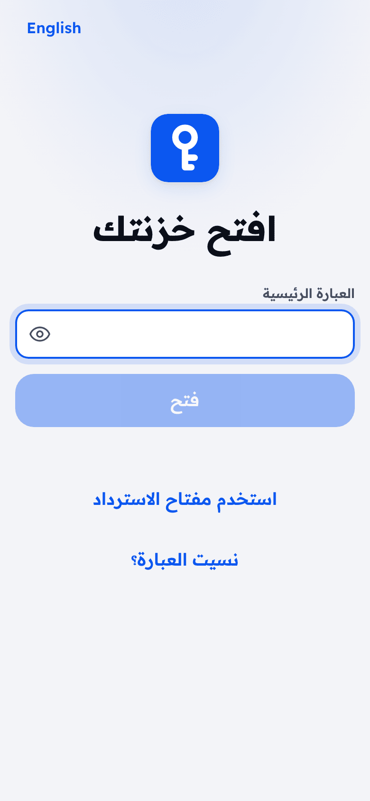
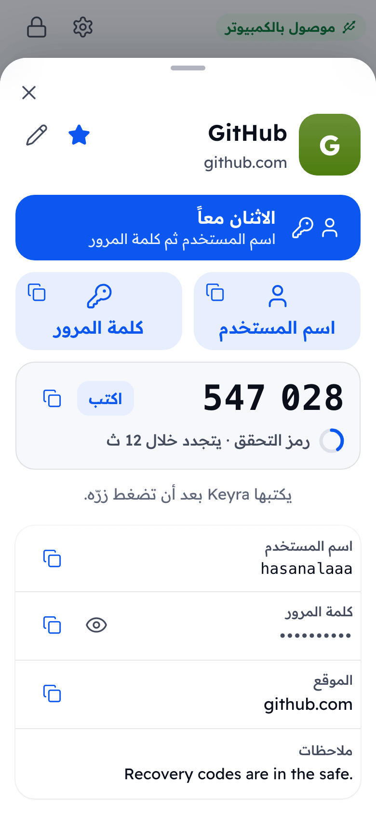

<div align="center">


# Keyra | كيرا

**خزنة كلمات مرور بحجم الجيب. كلماتك تبقى داخل الجهاز، وتديرها من هاتفك، ويكتبها Keyra عنك فقط عندما تضغط زره بيدك.**

[](https://github.com/hasanalaaa/keyra/actions/workflows/ci.yml)
[](LICENSE)
[](https://docs.espressif.com/projects/esp-idf/en/stable/esp32s3/)
[](docs/HARDWARE.md)

[كيف يعمل](#كيف-يعمل) ·
[البدء السريع](#البدء-السريع) ·
[الأمان](#نموذج-الأمان) ·
[العتاد](#العتاد) ·
[أسئلة شائعة](#أسئلة-شائعة) ·
[English](README.md)

</div>

---

<div dir="rtl">

## لماذا Keyra

أغلب مدراء كلمات المرور يعيشون داخل نفس الكمبيوتر والمتصفح الذي يستهدفه المخترقون. Keyra ينقل السر إلى مكان آخر.

- **خزنتك لا تعيش على الكمبيوتر.** لا شيء يُخزَّن أو يُزامَن عليه: الكمبيوتر يرى فقط لوحة مفاتيح تكتب الحساب الواحد الذي اخترته، في اللحظة التي اخترتها. لا إضافة متصفح، لا حافظة (clipboard)، ولا برنامج للتثبيت.
- **البرمجيات الخبيثة لا تستطيع جعله يكتب.** كل عملية تحتاج ضغطة فعلية على زر الجهاز. بدون ضغطة لا يُكتب شيء.
- **بلا سحابة، بلا حساب، بلا اشتراك.** الخزنة مشفّرة على الجهاز وتُدار عبر شبكة الواي فاي الخاصة بالجهاز. لا شيء يخرج من مكتبك.
- **يعمل على أي كمبيوتر.** أي جهاز يقبل لوحة مفاتيح USB (لابتوب العمل، شاشة عامة، تلفزيون، جهاز ألعاب) يعمل معه Keyra. لا حاجة لتثبيت شيء.
- **مفتوح المصدر ورخيص.** برنامج الجهاز بترخيص MIT ويعمل على لوحة تطوير سعرها بضعة دولارات. تقدر تقرأه وتبنيه وتعدّله.
- **سهل بما يكفي للاستخدام اليومي.** تطبيق للهاتف بالعربية والإنجليزية، مصمم ليكون بسيطاً مثل مدير كلمات المرور في هاتفك.

Keyra جهاز للراحة والعزل، وليس درعاً سحرياً. اقرأ [نموذج الأمان](#نموذج-الأمان) لتعرف بالضبط ما يحميه وما لا يحميه.

## كيف يعمل

<div align="center">

</div>

1. **وصّله.** وصّل منفذ USB الخاص بـ Keyra بالكمبيوتر. يظهر كلوحة مفاتيح.
2. **ادخل على الواي فاي.** من هاتفك اتصل بشبكة **Keyra-XXXX** ثم افتح **http://keyra.local**. (لا تظهر نافذة تسجيل دخول، راجع [الأسئلة الشائعة](#أسئلة-شائعة).)
3. **اختر الحساب وما تريد كتابته.** افتح الخزنة بعبارة المرور الرئيسية، اضغط على حساب، ثم اختر **اسم المستخدم** أو **كلمة المرور** أو **الاثنين معاً** أو **الرمز** (التحقق بخطوتين).
4. **اضغط الزر.** اضغط على خانة الدخول في الكمبيوتر، ثم اضغط زر Keyra فيكتب. يومض الضوء بالأخضر ويظهر في هاتفك **تمت الكتابة**.

الضغط الطويل (ثانية ونصف) يلغي العملية المعلّقة، أو يقفل الخزنة إذا لم تكن هناك عملية معلّقة.

## المزايا

| | |
|---|---|
| **يكتب مثل لوحة المفاتيح** | لوحة مفاتيح USB HID (تخطيط US). يتعامل مع Caps Lock ويحرر المفاتيح دائماً حتى عند حدوث خطأ. |
| **تطبيق ويب للهاتف أولاً** | يمكن تثبيته على الشاشة الرئيسية. بحث، مفضلة، الأخيرة، مولّد كلمات مرور ومقياس قوة. |
| **عربي وإنجليزي** | دعم كامل للكتابة من اليمين لليسار، يُكتشف تلقائياً ويمكن تبديله في أي وقت. |
| **رموز التحقق بخطوتين** | TOTP مدمج (SHA-1/256/512، ستة أو ثمانية أرقام). يستطيع Keyra كتابة الرمز أيضاً. |
| **خزنة مشفّرة** | PBKDF2-HMAC-SHA256 (حوالي 1.2 ثانية على الجهاز) وتشفير AES-256-GCM لكل حساب على حدة. |
| **تحديد محاولات الفتح** | تُحسب المحاولات الفاشلة قبل تشغيل اشتقاق المفتاح، وإعادة تشغيل الجهاز لا تلغي مدة الانتظار. |
| **استيراد** | انقل حساباتك من ملفات CSV الخاصة بـ Apple Passwords أو Chrome أو Bitwarden أو 1Password. |
| **نسخة احتياطية مشفّرة** | ملف JSON محمي بعبارة مرور، والاستعادة بالدمج أو الاستبدال. |
| **تأكيد فعلي** | الكتابة والإعداد الأول وتغيير الواي فاي وإعادة ضبط المصنع كلها تحتاج ضغطة زر. |
| **ضوء الحالة** | مقفول، جاهز، يكتب، نجاح، خطأ، تُقرأ بنظرة. |
| **قفل تلقائي** | يقفل بعد خمول (من دقيقة إلى 120 دقيقة) ويمسح المفاتيح من الذاكرة. |
| **بلا ارتباط بجهة** | صيغ قياسية وبروتوكول مفتوح ([docs/SPEC.md](docs/SPEC.md)) وترخيص MIT. |

## لقطات الشاشة

<!-- ستُنشأ اللقطات في web/screenshots/. استبدل هذه الكتلة بالجدول أدناه بعد وجود الملفات.

| الفتح | الخزنة | الحساب | جاهز للكتابة |
|:--:|:--:|:--:|:--:|
|  |  |  |  |

-->

_ستتوفر اللقطات مع الإصدار الأول._

## نموذج الأمان

الخلاصة فقط. نموذج التهديدات الكامل وتفاصيل التشفير وجدول تحديد المحاولات في **[SECURITY.md](SECURITY.md)** (بالإنجليزية).

**ما يفعله Keyra**

- يشفّر كل حساب بـ AES-256-GCM بمفتاح بيانات عشوائي، وهذا المفتاح محمي بمفتاح مشتق من عبارة المرور (PBKDF2-HMAC-SHA256 بمعايرة حوالي 1.2 ثانية).
- يحدّد محاولات الفتح ويحسبها بشكل دائم.
- لا يكتب إلا بعد ضغطة زر فعلية. ولا يعطي الكمبيوتر أي قناة تخزين أو شبكة.
- يحتفظ بالبيانات المفكوكة في الذاكرة فقط وهو مفتوح، ويمسحها عند القفل.

**ما لا يفعله (حدود نقولها بصراحة)**

- **الاتصال بين الهاتف والجهاز HTTP عادي فوق WPA2** وليس TLS. من يعرف كلمة سر واي فاي الجهاز وهو على الشبكة يستطيع مراقبة الحركة. أبقِ كلمة سر الواي فاي سرية.
- **لا يوجد عنصر آمن (secure element).** من يملك الجهاز فعلياً يستطيع نسخ الذاكرة المحلية وتخمين العبارة بدون اتصال. استخدم عبارة طويلة.
- **تشفير الفلاش والإقلاع الآمن اختياريان** ومطفآن افتراضياً. وهما خطوات eFuse لا رجعة فيها ([docs/HARDWARE.md](docs/HARDWARE.md#optional-hardening-irreversible)).
- **لم تتم مراجعة Keyra أمنياً من جهة مستقلة.**
- برنامج تجسس لوحة مفاتيح على الكمبيوتر يستطيع رؤية ما يكتبه Keyra، مثل أي لوحة مفاتيح.

للإبلاغ عن ثغرة استخدم **GitHub Security Advisory الخاص** كما هو موضح في [SECURITY.md](SECURITY.md#reporting-a-vulnerability).

## العتاد

<div align="center">

<br><sub>تصوّر لغلاف مستقبلي. حالياً يعمل Keyra على لوحة تطوير ESP32-S3 عادية.</sub>
</div>

يعمل Keyra على لوحة تطوير جاهزة من نوع **ESP32-S3** بذاكرة فلاش **8 ميغابايت على الأقل**. بدون لحام.

| | |
|---|---|
| **اللوحة المرجعية** | ESP32-S3-DevKitC-1 **N16R8** (ذاكرة PSRAM اختيارية) |
| **الزر** | GPIO0 (زر **BOOT** في اللوحة) |
| **ضوء الحالة** | WS2812 على **GPIO38** (إصدار DevKitC-1 v1.1) أو **GPIO48** (إصدار v1.0)، يُضبط بالخيار `CONFIG_KEYRA_LED_GPIO` |
| **USB** | وصّل منفذ **USB** الأصلي للوحة بالكمبيوتر (وليس منفذ UART) |

تفاصيل الأطراف وطرق الفلاش وأفكار العلبة وخطوات التقوية الاختيارية: **[docs/HARDWARE.md](docs/HARDWARE.md)** (بالإنجليزية).

## البدء السريع

### الخيار أ: فلاش نسخة جاهزة

1. نزّل ملفات الإصدار من [صفحة Releases](https://github.com/hasanalaaa/keyra/releases).
2. ضع اللوحة في وضع التحميل (اضغط **BOOT**، وصّل منفذ **USB**، ثم أفلت **BOOT**)، أو استخدم منفذ **UART** الذي لا يحتاج الزر.
3. اعمل الفلاش بأداة [esptool](https://docs.espressif.com/projects/esptool/en/latest/) (العناوين من `flasher_args.json`):

```sh
esptool.py --chip esp32s3 -p <PORT> --before default-reset --after hard-reset \
  write_flash --flash-mode dio --flash-size 8MB --flash-freq 80m \
  0x0 bootloader.bin 0x8000 partition-table.bin 0xf000 ota_data_initial.bin 0x20000 keyra.bin
```

### الخيار ب: البناء من المصدر

تحتاج [ESP-IDF 6.0.x](https://docs.espressif.com/projects/esp-idf/en/stable/esp32s3/get-started/) مثبتاً ومفعّلاً في الطرفية (يستخدم CI النسخة v6.0.2).

```sh
git clone https://github.com/hasanalaaa/keyra.git
cd keyra/firmware

# نسخة الإصدار: لوحة مفاتيح فقط وبدون سجلات. الموصى بها للاستخدام اليومي.
idf.py -B build-release -D SDKCONFIG_DEFAULTS="sdkconfig.defaults;sdkconfig.release" build
idf.py -B build-release -p <PORT> flash

# نسخة التطوير: تضيف منفذ سجلات USB وخاصية إعادة التشغيل إلى وضع ROM عبر 1200 baud.
idf.py build
idf.py -p <PORT> flash monitor
```

تطبيق الويب المبني موجود مسبقاً في `firmware/components/keyra_api/www/`، لذلك **لا تحتاج Node.js** لبناء برنامج الجهاز. لإعادة بناء تطبيق الويب وتحديث تلك الملفات:

```sh
npm --prefix web ci && npm --prefix web run build
```

### الإعداد لأول مرة

1. وصّل منفذ **USB** الخاص بـ Keyra بالكمبيوتر.
2. من هاتفك اتصل بشبكة **Keyra-XXXX** (آخر أربعة رموز من عنوان اللوحة). كلمة السر الافتراضية **`keyra1234`** وهي معروفة للجميع، والإعداد الأول يجبرك على تغييرها.
3. افتح **http://keyra.local** (أو `http://192.168.4.1`). اضغط **مشاركة ثم إضافة إلى الشاشة الرئيسية** ليصير الدخول بنقرة واحدة.
4. اتبع الخطوات الثلاث: اختر **عبارة المرور الرئيسية** (10 أحرف أو أكثر، والأطول أفضل)، ثم اختر **كلمة سر واي فاي جديدة**، ثم **اضغط زر Keyra** لتثبت أنك تحمل الجهاز.
5. أضف حساباتك، أو استورد ملف CSV من مدير كلمات المرور الحالي (احذف الملف بعدها فهو غير مشفّر).

## هيكل المشروع

```
keyra/
├── firmware/                  مشروع ESP-IDF 6.0 (C++17)
│   ├── main/                  app_main: ربط الأجزاء فقط
│   ├── components/
│   │   ├── keyra_vault/       التشفير والتخزين المشفّر وTOTP والنسخ الاحتياطي (له اختبارات على الكمبيوتر)
│   │   ├── keyra_hid/         لوحة مفاتيح TinyUSB ومحرك الكتابة ومنفذ CDC للتطوير
│   │   ├── keyra_io/          الزر (GPIO0) وضوء RGB
│   │   ├── keyra_net/         نقطة وصول الواي فاي وDNS وmDNS (keyra.local)
│   │   └── keyra_api/         خادم HTTP وواجهة REST والجلسات وآلة حالة العمليات المعلّقة
│   ├── test/host/             مشغّل اختبارات على الكمبيوتر (CMake + ctest، بدون لوحة)
│   ├── partitions.csv         توزيع 8 ميغابايت: نسختان للتطبيق + خزنة LittleFS
│   └── sdkconfig.defaults / sdkconfig.release   ملفا التطوير والإصدار
├── web/                       تطبيق Preact + TypeScript يُبنى في ملف واحد مضغوط
├── tools/                     devctl.py: فلاش وإعادة تشغيل وسجلات عبر USB الأصلي
├── docs/                      SPEC.md وDESIGN.md وHARDWARE.md وIMAGE_PROMPTS.md وimages/
└── .github/                   CI وقوالب البلاغات وطلبات الدمج
```

[docs/SPEC.md](docs/SPEC.md) هو العقد بين برنامج الجهاز وتطبيق الويب (واجهة REST والسلوك ونموذج الأمان). [docs/DESIGN.md](docs/DESIGN.md) هو نظام التصميم.

## التطوير

```sh
# اختبارات على الكمبيوتر: الخزنة وTOTP وخريطة المفاتيح وآلة حالة العمليات. لا تحتاج لوحة.
# تحتاج CMake ومترجم C++17 وملفات OpenSSL 3 (libssl-dev، أو openssl@3 على Homebrew).
cmake -S firmware/test/host -B build/host && cmake --build build/host && ctest --test-dir build/host

# الويب: فحص الأنواع والاختبارات
npm --prefix web ci
npm --prefix web run typecheck
npm --prefix web test

# واجهة الويب بدون لوحة: محاكاة لواجهة الجهاز
npm --prefix web run mock
```

يشغّل CI اختبارات الجهاز وفحوصات الويب وبناء النسختين (التطوير والإصدار) مع كل دفع وطلب دمج. راجع [CONTRIBUTING.md](CONTRIBUTING.md).

## خارطة الطريق

أفكار وليست وعوداً. الأولويات تتبع ما يبلغ عنه المستخدمون على لوحاتهم الفعلية.

- [x] 0.1: خزنة مشفّرة، كتابة عبر USB، تطبيق هاتف (عربي/إنجليزي)، TOTP، استيراد، نسخ احتياطي، CI
- [ ] جدول لوحات مجرّبة ونسخة جاهزة لكل لوحة
- [ ] الفلاش من المتصفح مباشرة من صفحة الإصدار
- [ ] تخطيطات لوحة مفاتيح أخرى (خريطة المفاتيح الآن US فقط)
- [ ] علبة قابلة للطباعة ولوحة دوائر مخصصة
- [ ] تحديثات البرنامج عبر الهواء (جدول الأقسام فيه نسختان للتطبيق أصلاً)
- [ ] مراجعة أمنية مستقلة

## أسئلة شائعة

**لماذا لا تظهر في هاتفي نافذة "تسجيل الدخول إلى الواي فاي"؟**
هذا مقصود. Keyra يرد على فحوصات الاتصال في هاتفك بأنه "متصل" فيدخل الهاتف عليه كأي شبكة عادية ولا يفتح نافذة صغيرة (captive portal) غالباً لا تشغّل التطبيق جيداً ولا تحفظ ملفات الارتباط. افتح فقط **http://keyra.local** في متصفحك المعتاد. وإذا لم يعمل الاسم استخدم `http://192.168.4.1`.

**هل يعمل مع تخطيطات لوحة مفاتيح غير US؟**
حالياً يكتب Keyra كلوحة مفاتيح **بتخطيط US**. إذا كان الكمبيوتر على تخطيط آخر (مثل العربي) ستخرج الأحرف مختلفة. بدّل الكمبيوتر إلى US عند خانة الدخول، أو اجعل كلمات المرور من رموز متطابقة في التخطيطين. الأحرف خارج ASCII القابل للطباعة تُرفض مع رسالة واضحة بدل كتابة حرف خاطئ. تخطيطات أخرى في خارطة الطريق.

**نسيت عبارة المرور الرئيسية. هل أستطيع استرجاع كلماتي؟**
لا. هذه هي فائدة التشفير ولا يوجد باب خلفي. لكن تستطيع **مسح الجهاز والبدء من جديد**: في شاشة الفتح اختر **نسيت العبارة؟** ثم اضغط زر Keyra للتأكيد. كل الحسابات تُحذف. استعدها من نسخة احتياطية إن كانت عندك.

**هل هو آمن أن يكتب بضغطة زر؟ ماذا لو كانت النافذة الخطأ في المقدمة؟**
العملية تبقى جاهزة 60 ثانية وتُنفَّذ مرة واحدة عند الضغط. اضغط على الخانة الصحيحة أولاً. والضغط الطويل يلغي.

**لماذا HTTP وليس HTTPS؟**
جهاز على شبكته الخاصة لا يستطيع الحصول على شهادة يثق بها المتصفح بدون تثبيت شيء على كل هاتف، وتحذير المتصفح يعوّد الناس على تجاهل التحذيرات. بدلاً من ذلك يُحمى الرابط بـ WPA2 وكلمة سر واي فاي خاصة. هذا حد حقيقي: راجع [SECURITY.md](SECURITY.md).

**هل أحتاج اتصالاً بالإنترنت؟**
لا. Keyra ينشئ شبكة الواي فاي الخاصة به، وهاتفك لا يحتاج إنترنت وهو متصل بها (قد يستمر في استخدام بيانات الموبايل لبقية التطبيقات).

**هل يستطيع الكمبيوتر قراءة خزنتي؟**
Keyra يعرض للكمبيوتر لوحة مفاتيح فقط. لا واجهة تخزين ولا مسار شبكة إليه. الكمبيوتر يرى ما يُكتب فقط ولا شيء غيره.

**كم يكلّف؟**
لوحة ESP32-S3 متوافقة تكلّف عادة من بضعة دولارات إلى عشرة تقريباً.

## المساهمة

بلاغات الأخطاء وتقارير تجربة العتاد والترجمات وطلبات الدمج مرحّب بها. ابدأ من [CONTRIBUTING.md](CONTRIBUTING.md) و[مدونة السلوك](CODE_OF_CONDUCT.md). للمسائل الأمنية استخدم البلاغ الخاص ([SECURITY.md](SECURITY.md)).

## الترخيص

[MIT](LICENSE) © 2026 hasanalaaa. المكونات الخارجية تحتفظ بتراخيصها (ESP-IDF وTinyUSB وLittleFS وcJSON وPreact).

</div>
