<div align="center">

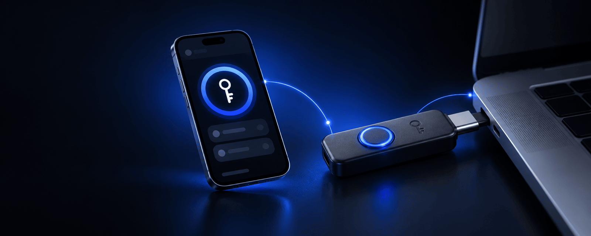

# Keyra | كيرا

**خزنة كلمات مرور بحجم الجيب. كلماتك تبقى داخل الجهاز، وتديرها من هاتفك، ويكتبها Keyra عنك فقط عندما تضغط زره بيدك.**

[](https://github.com/hasanalaaa/keyra/actions/workflows/ci.yml)
[](LICENSE)
[](https://docs.espressif.com/projects/esp-idf/en/stable/esp32s3/)
[](docs/HARDWARE.md)

[كيف يعمل](#كيف-يعمل) ·
[البدء السريع](#البدء-السريع) ·
[الأمان](#نموذج-الأمان) ·
[العتاد](#العتاد) ·
[أسئلة شائعة](#أسئلة-شائعة) ·
[English](README.md)

</div>

---

<div dir="rtl">

## لماذا Keyra

أغلب مدراء كلمات المرور يعيشون داخل نفس الكمبيوتر والمتصفح الذي يستهدفه المخترقون. Keyra ينقل السر إلى مكان آخر.

- **خزنتك لا تعيش على الكمبيوتر.** لا شيء يُخزَّن أو يُزامَن عليه: الكمبيوتر يرى فقط لوحة مفاتيح تكتب الحساب الواحد الذي اخترته، في اللحظة التي اخترتها. لا إضافة متصفح، لا حافظة (clipboard)، ولا برنامج للتثبيت.
- **البرمجيات الخبيثة لا تستطيع جعله يكتب.** كل عملية تحتاج ضغطة فعلية على زر الجهاز. بدون ضغطة لا يُكتب شيء.
- **بلا سحابة، بلا حساب، بلا اشتراك.** الخزنة مشفّرة على الجهاز وتُدار عبر شبكة الواي فاي الخاصة بالجهاز. لا شيء يخرج من مكتبك.
- **يعمل على أي كمبيوتر.** أي جهاز يقبل لوحة مفاتيح USB (لابتوب العمل، شاشة عامة، تلفزيون، جهاز ألعاب) يعمل معه Keyra. والهواتف والأجهزة اللوحية والحواسيب التي ليس فيها منفذ متاح تقترن به عبر البلوتوث. لا حاجة لتثبيت شيء.
- **مفتوح المصدر ورخيص.** برنامج الجهاز بترخيص MIT ويعمل على لوحة تطوير سعرها بضعة دولارات. تقدر تقرأه وتبنيه وتعدّله.
- **سهل بما يكفي للاستخدام اليومي.** تطبيق للهاتف بالعربية والإنجليزية، مصمم ليكون بسيطاً مثل مدير كلمات المرور في هاتفك.

Keyra جهاز للراحة والعزل، وليس درعاً سحرياً. اقرأ [نموذج الأمان](#نموذج-الأمان) لتعرف بالضبط ما يحميه وما لا يحميه.

## كيف يعمل

<div align="center">
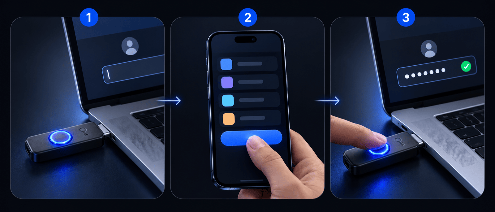
</div>

1. **وصّله.** وصّل منفذ USB الخاص بـ Keyra بالكمبيوتر. يظهر كلوحة مفاتيح. (أو اقرنه مرة واحدة عبر البلوتوث، انظر أدناه.)
2. **ادخل على الواي فاي.** من هاتفك اتصل بشبكة **Keyra-XXXX** ثم افتح **http://keyra.local**. (لا تظهر نافذة تسجيل دخول، راجع [الأسئلة الشائعة](#أسئلة-شائعة).)
3. **اختر الحساب وما تريد كتابته.** افتح الخزنة بعبارة المرور الرئيسية، اضغط على حساب، ثم اختر **اسم المستخدم** أو **كلمة المرور** أو **الاثنين معاً** أو **الرمز** (التحقق بخطوتين).
4. **اضغط الزر.** اضغط على خانة الدخول في الكمبيوتر، ثم اضغط زر Keyra فيكتب. يومض الضوء بالأخضر ويظهر في هاتفك **تمت الكتابة**.

الضغط الطويل (ثانية ونصف) يلغي العملية المعلّقة، أو يقفل الخزنة إذا لم تكن هناك عملية معلّقة.

**البلوتوث.** من **الإعدادات ← البلوتوث** اضغط **إقران جهاز جديد** ثم اضغط زر Keyra. خلال الدقيقتين التاليتين يظهر Keyra كلوحة مفاتيح في إعدادات البلوتوث في هاتفك أو جهازك اللوحي أو حاسوبك، ويومض ضوؤه باللون السماوي؛ اختره من هناك. بعدها يكتب خيار **الكتابة في: تلقائي** عبر USB حين يكون Keyra موصولاً، وإلا ففي آخر جهاز بلوتوث استخدمته (أو اختر جهازاً من صفحة الحساب). يتصل Keyra به وقت العملية فقط، وشاشة «جاهز» تخبرك بأي جهاز سيكتب.

## المزايا

| | |
|---|---|
| **يكتب مثل لوحة المفاتيح** | لوحة مفاتيح USB وبلوتوث. يتعامل مع Caps Lock ويحرر المفاتيح دائماً حتى عند حدوث خطأ. |
| **أي لغة إدخال** | أخبر Keyra بنظام كل جهاز مرة واحدة: على Windows يكتب برموز الأحرف التي لا تتأثر باللغة المفعّلة، وعلى Mac أو iPhone المضبوط على العربية يحوّل إلى الإنكليزية ثم يكتب ثم يعيدها. |
| **مفاتيح المرور ومفتاح الأمان (USB)** | Keyra مفتاح أمان FIDO2/U2F أيضاً: أنشئ مفاتيح المرور (passkeys) واستخدمها، أو استخدمه عاملاً ثانياً، في المواقع التي تدعم مفاتيح الأمان. اضغط الزر حين يومض الضوء بالأبيض ومضتين. حتى 50 مفتاح مرور تظهر في **الإعدادات ← مفاتيح المرور**. غير معتمد من FIDO؛ التفاصيل في [docs/FIDO.md](docs/FIDO.md) (بالإنجليزية). |
| **لوحة مفاتيح بلوتوث** | بلوتوث منخفض الطاقة (HID over GATT) للهواتف والأجهزة اللوحية والحواسيب، بمحرك الكتابة نفسه. الإقران لا يُفتح إلا دقيقتين بعد ضغط الزر، وحتى أربعة أجهزة، وتستطيع إلغاء إقران أي منها من التطبيق. |
| **تطبيق ويب للهاتف أولاً** | يمكن تثبيته على الشاشة الرئيسية. بحث، مفضلة، الأخيرة، ومقياس قوة. |
| **مولّد كلمات المرور** | يولّد Keyra كلمات المرور بمولّد العشوائية في عتاده: من 8 إلى 128 حرفاً، تختار a–z / A–Z / 0–9 / الرموز، وأقل عدد من الأرقام والرموز، وتجنّب الأحرف المتشابهة. يعرض القوة الدقيقة بالبت. اكتبها، أو اكتبها مرتين (لخانة «تأكيد كلمة المرور»)، أو انسخها، أو احفظها. |
| **سجلّ كلمات المرور** | تغيير كلمة المرور يُبقي القديمة: آخر 10 بتواريخها، داخل الحساب المشفّر. اعرض أيّاً منها أو انسخها. |
| **كتابة أي نص** | Keyra لوحة مفاتيح عن بُعد: يكتب حتى 256 حرفاً (مفتاح واي فاي، رمز لمرة واحدة) بعد ضغطة زر، ثم ينسى النص فوراً. |
| **عربي وإنجليزي** | دعم كامل للكتابة من اليمين لليسار، يُكتشف تلقائياً ويمكن تبديله في أي وقت. |
| **رموز التحقق بخطوتين** | TOTP مدمج (SHA-1/256/512، ستة أو ثمانية أرقام، 30 أو 60 ثانية). يستطيع Keyra كتابة الرمز أيضاً. أضف المفتاح بلصق مفتاح الإعداد أو رابط `otpauth://`، أو بزرّ **امسح رمز QR من صورة**. |
| **خزنة مشفّرة** | PBKDF2-HMAC-SHA256 (حوالي 1.2 ثانية على الجهاز) وتشفير AES-256-GCM لكل حساب على حدة. |
| **تحديد محاولات الفتح** | تُحسب المحاولات الفاشلة قبل تشغيل اشتقاق المفتاح، وإعادة تشغيل الجهاز لا تلغي مدة الانتظار. |
| **استيراد** | انقل حساباتك من ملفات CSV الخاصة بـ Apple Passwords أو Chrome أو Bitwarden أو 1Password، أو انقل مفاتيح التحقق من رمز QR الذي يصدّره Google Authenticator. |
| **نسخة احتياطية مشفّرة** | ملف JSON محمي بعبارة مرور، والاستعادة بالدمج أو الاستبدال. |
| **تأكيد فعلي** | الكتابة وتسجيل الدخول بمفتاح المرور أو مفتاح الأمان والإعداد الأول وتغيير الواي فاي وإقران البلوتوث وإعادة ضبط المصنع كلها تحتاج ضغطة زر. |
| **واي فاي المنزل (اختياري)** | يستطيع Keyra الانضمام إلى شبكة منزلك فيُفتح `keyra.local` من أي جهاز عليها. كل متصفح جديد هناك يُوثَّق مرة واحدة بضغطة الزر. |
| **ضوء الحالة** | مقفول، جاهز، يكتب، نجاح، خطأ، تُقرأ بنظرة. |
| **قفل تلقائي** | يقفل بعد خمول (من دقيقة إلى 120 دقيقة) ويمسح المفاتيح من الذاكرة. |
| **بلا ارتباط بجهة** | صيغ قياسية وبروتوكول مفتوح ([docs/SPEC.md](docs/SPEC.md)) وترخيص MIT. |

## لقطات الشاشة

| خزنتك | جاهز — اضغط الزر | تمت الكتابة ✓ | الحساب (داكن) |
|:--:|:--:|:--:|:--:|
| 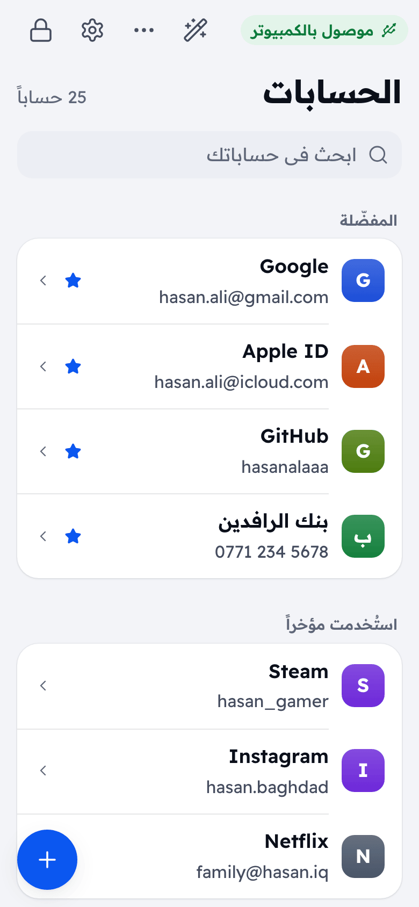 | 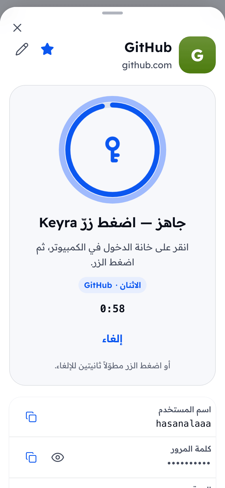 | 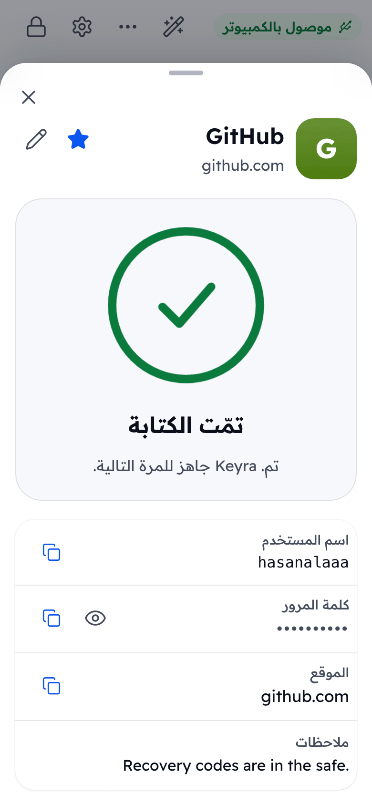 | 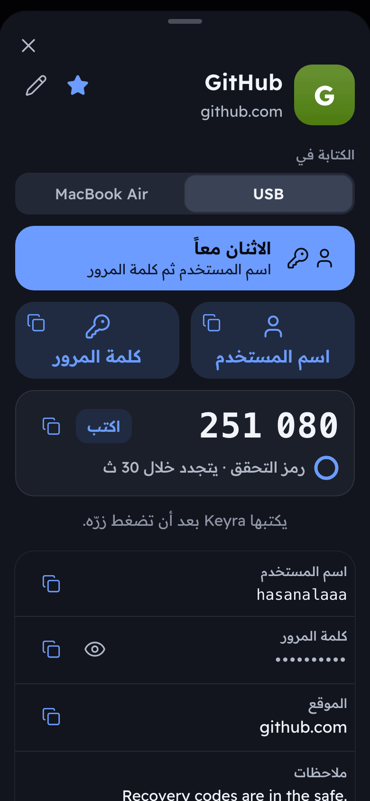 |

| كلمة مرور جديدة | سجلّ كلمات المرور | كتابة نص |
|:--:|:--:|:--:|
| 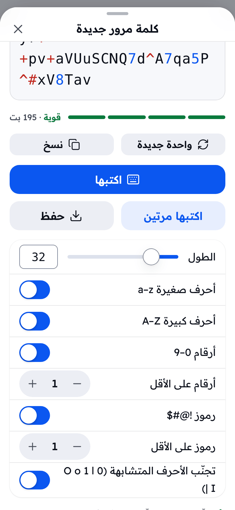 | 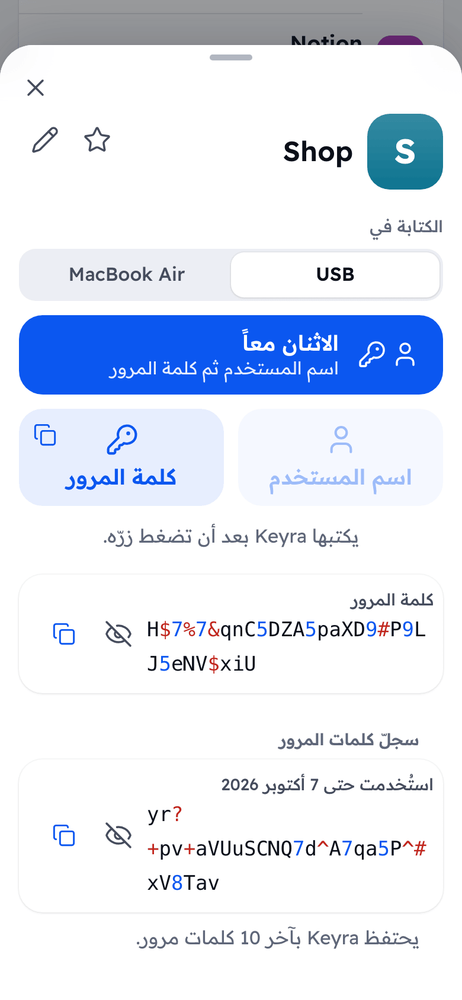 | 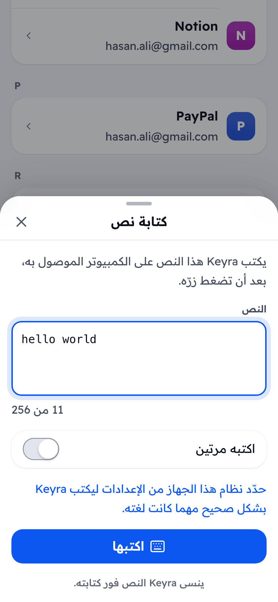 |

<p align="center">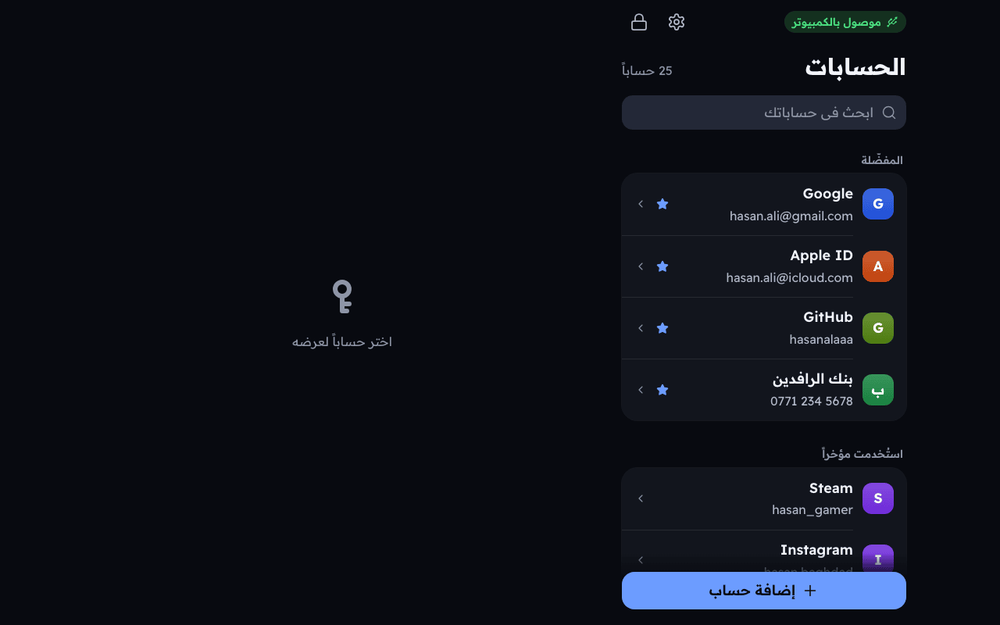</p>

بالعربي (من اليمين لليسار) والإنكليزي، فاتح وداكن، هاتف وكمبيوتر — كلها مأخوذة من التطبيق الحقيقي عبر `npm --prefix web run e2e` (كل الشاشات في [web/screenshots](web/screenshots)).

## نموذج الأمان

الخلاصة فقط. نموذج التهديدات الكامل وتفاصيل التشفير وجدول تحديد المحاولات في **[SECURITY.md](SECURITY.md)** (بالإنجليزية).

**ما يفعله Keyra**

- يشفّر كل حساب بـ AES-256-GCM بمفتاح بيانات عشوائي، وهذا المفتاح محمي بمفتاح مشتق من عبارة المرور (PBKDF2-HMAC-SHA256 بمعايرة حوالي 1.2 ثانية).
- يحدّد محاولات الفتح ويحسبها بشكل دائم.
- لا يكتب إلا بعد ضغطة زر فعلية. ولا يعطي الكمبيوتر أي قناة تخزين أو شبكة.
- لا يوقّع طلبات مفاتيح المرور ومفتاح الأمان إلا وهو مفتوح وبعد ضغطة زر، ومفاتيحها مشفّرة بمفتاح الخزنة ([docs/FIDO.md](docs/FIDO.md)).
- لا يسمح بإقران جهاز بلوتوث جديد إلا خلال دقيقتين تفتحهما ضغطة زر؛ وفي بقية الوقت لا تستطيع الاتصال به إلا الأجهزة المقترنة مسبقاً.
- يحتفظ بالبيانات المفكوكة في الذاكرة فقط وهو مفتوح، ويمسحها عند القفل.

**ما لا يفعله (حدود نقولها بصراحة)**

- **الاتصال بين الهاتف والجهاز HTTP عادي فوق WPA2** وليس TLS. من يعرف كلمة سر واي فاي الجهاز وهو على الشبكة يستطيع مراقبة الحركة. أبقِ كلمة سر الواي فاي سرية.
- **لا يوجد عنصر آمن (secure element).** من يملك الجهاز فعلياً يستطيع نسخ الذاكرة المحلية وتخمين العبارة بدون اتصال. استخدم عبارة طويلة.
- **تشفير الفلاش والإقلاع الآمن اختياريان** ومطفآن افتراضياً. وهما خطوات eFuse لا رجعة فيها ([docs/HARDWARE.md](docs/HARDWARE.md#optional-hardening-irreversible)).
- **لم تتم مراجعة Keyra أمنياً من جهة مستقلة.**
- برنامج تجسس لوحة مفاتيح على الكمبيوتر يستطيع رؤية ما يكتبه Keyra، مثل أي لوحة مفاتيح.
- **مفتاح الأمان غير معتمد من FIDO** ويستخدم إثباتاً ذاتياً؛ وبلا عنصر آمن تكون مفاتيحه آمنة بقدر عبارة المرور. و«التحقق من المستخدم» معناه أن Keyra مفتوح، وليس رمز PIN أو بصمة لكل دخول.
- **إقران البلوتوث من نوع "Just Works"** (لا شاشة في Keyra لعرض رمز). من يكون ضمن مدى الإشارة خلال دقيقتي الإقران قد يقرن جهازه هو، أو يحاول التوسّط بينك وبين جهازك. اقرن أجهزتك في مكان ترى فيه من حولك، وراجع قائمة الأجهزة بعد ذلك. التفاصيل في [SECURITY.md](SECURITY.md#bluetooth).

للإبلاغ عن ثغرة استخدم **GitHub Security Advisory الخاص** كما هو موضح في [SECURITY.md](SECURITY.md#reporting-a-vulnerability).

## العتاد

<div align="center">
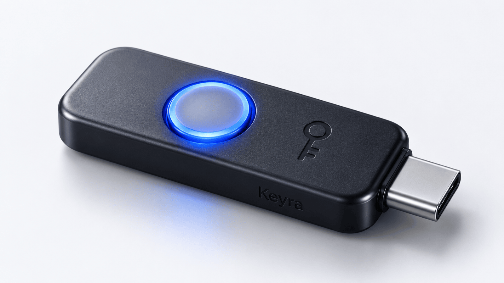
<br><sub>تصوّر لغلاف مستقبلي. حالياً يعمل Keyra على لوحة تطوير ESP32-S3 عادية.</sub>
</div>

يعمل Keyra على لوحة تطوير جاهزة من نوع **ESP32-S3** بذاكرة فلاش **8 ميغابايت على الأقل**. بدون لحام.

| | |
|---|---|
| **اللوحة المرجعية** | ESP32-S3-DevKitC-1 **N16R8** (ذاكرة PSRAM اختيارية) |
| **الزر** | GPIO0 (زر **BOOT** في اللوحة) |
| **ضوء الحالة** | WS2812 على **GPIO38** (إصدار DevKitC-1 v1.1) أو **GPIO48** (إصدار v1.0)، يُضبط بالخيار `CONFIG_KEYRA_LED_GPIO` |
| **USB** | وصّل منفذ **USB** الأصلي للوحة بالكمبيوتر (وليس منفذ UART) |

تفاصيل الأطراف وطرق الفلاش وأفكار العلبة وخطوات التقوية الاختيارية: **[docs/HARDWARE.md](docs/HARDWARE.md)** (بالإنجليزية).

## البدء السريع

### الخيار أ: فلاش نسخة جاهزة

1. نزّل ملفات الإصدار من [صفحة Releases](https://github.com/hasanalaaa/keyra/releases).
2. ضع اللوحة في وضع التحميل (اضغط **BOOT**، وصّل منفذ **USB**، ثم أفلت **BOOT**)، أو استخدم منفذ **UART** الذي لا يحتاج الزر.
3. اعمل الفلاش بأداة [esptool](https://docs.espressif.com/projects/esptool/en/latest/) (العناوين من `flasher_args.json`):

```sh
esptool.py --chip esp32s3 -p <PORT> --before default-reset --after hard-reset \
  write_flash --flash-mode dio --flash-size 8MB --flash-freq 80m \
  0x0 bootloader.bin 0x8000 partition-table.bin 0xf000 ota_data_initial.bin 0x20000 keyra.bin
```

### الخيار ب: البناء من المصدر

تحتاج [ESP-IDF 6.0.x](https://docs.espressif.com/projects/esp-idf/en/stable/esp32s3/get-started/) مثبتاً ومفعّلاً في الطرفية (يستخدم CI النسخة v6.0.2).

```sh
git clone https://github.com/hasanalaaa/keyra.git
cd keyra/firmware

# نسخة الإصدار: لوحة مفاتيح فقط وبدون سجلات. الموصى بها للاستخدام اليومي.
idf.py -B build-release -D SDKCONFIG_DEFAULTS="sdkconfig.defaults;sdkconfig.release" build
idf.py -B build-release -p <PORT> flash

# نسخة التطوير: تضيف منفذ سجلات USB وخاصية إعادة التشغيل إلى وضع ROM عبر 1200 baud.
idf.py build
idf.py -p <PORT> flash monitor
```

تطبيق الويب المبني موجود مسبقاً في `firmware/components/keyra_api/www/`، لذلك **لا تحتاج Node.js** لبناء برنامج الجهاز. لإعادة بناء تطبيق الويب وتحديث تلك الملفات:

```sh
npm --prefix web ci && npm --prefix web run build
```

### الإعداد لأول مرة

1. وصّل منفذ **USB** الخاص بـ Keyra بالكمبيوتر.
2. من هاتفك اتصل بشبكة **Keyra-XXXX** (آخر أربعة رموز من عنوان اللوحة). كلمة السر الافتراضية **`keyra1234`** وهي معروفة للجميع، والإعداد الأول يجبرك على تغييرها.
3. افتح **http://keyra.local** (أو `http://192.168.4.1`). اضغط **مشاركة ثم إضافة إلى الشاشة الرئيسية** ليصير الدخول بنقرة واحدة.
4. اتبع الخطوات الثلاث: اختر **عبارة المرور الرئيسية** (10 أحرف أو أكثر، والأطول أفضل)، ثم اختر **كلمة سر واي فاي جديدة**، ثم **اضغط زر Keyra** لتثبت أنك تحمل الجهاز.
5. أضف حساباتك، أو استورد ملف CSV من مدير كلمات المرور الحالي (احذف الملف بعدها فهو غير مشفّر).

### واي فاي المنزل (اختياري)

يستطيع Keyra أيضاً الانضمام إلى شبكة منزلك، فتفتحه من أي هاتف أو حاسوب في البيت دون تبديل شبكة الواي فاي.

1. من **الإعدادات ← شبكة Wi‑Fi المنزلية** فعّل **استخدم شبكة المنزل** واختر شبكتك. لا ينضم Keyra إلا إلى الشبكات المحمية بكلمة سر (WPA2/WPA3).
2. اكتب كلمة سر الشبكة واضغط **انضمام**، ثم **اضغط زر Keyra**. تعرض الصفحة **متصل** وعنوان Keyra على شبكتك وقوة الإشارة.
3. من أي جهاز على تلك الشبكة افتح **http://keyra.local**. وإذا لم يتعرّف جهاز على أسماء `.local` فاستخدم العنوان الظاهر في الصفحة.
4. في أول مرة يفتح فيها كل متصفح خزنة Keyra عبر شبكة المنزل، يطلب منك Keyra **ضغط زرّه لتثق بذلك المتصفح**. المتصفحات الموثوقة (حتى 8) تظهر في **الإعدادات ← المتصفحات الموثوقة** ويمكنك إزالتها من هناك، وإزالة متصفح تُنهي جلسته.

خيار **أبقِ شبكة Keyra الخاصة تعمل** مفعّل افتراضياً. إن أوقفته تنطفئ شبكة Keyra الخاصة بعد نحو 15 ثانية من انضمامه إلى شبكة منزلك، وتعود إذا غابت شبكة المنزل 60 ثانية، أو بعد 30 ثانية من التشغيل إن لم ينضم Keyra حتى ذلك الحين، فيبقى Keyra في متناولك دائماً. لدى Keyra هوائي واحد: تنتقل شبكته الخاصة إلى قناة شبكة منزلك، وقد تعيد الهواتف المتصلة بها الاتصال مرة واحدة. وما دام متصلاً بشبكة المنزل يضبط Keyra ساعته من الإنترنت (NTP)، فتعمل رموز التحقق بخطوتين دون أن يضبطها الهاتف.

### كلمة مرور جديدة لموقع

1. في صفحة التسجيل أو تغيير كلمة المرور في الموقع، اضغط **العصا السحرية** أعلى قائمة الحسابات في Keyra. يولّد Keyra كلمة مرور (20 حرفاً افتراضياً، ويتذكر الإعدادات في هذا المتصفح).
2. انقر على خانة كلمة المرور الأولى في الموقع، واضغط **اكتبها مرتين**، ثم **اضغط زرّ Keyra**. يكتبها Keyra ثم يضغط Tab ثم يكتبها في خانة التأكيد.
3. اضغط **حفظ**: **حساب جديد** يفتح نموذجاً معبّأً، و**تحديث حساب** يستبدل كلمة مرور ذلك الحساب. تبقى القديمة في **سجلّ كلمات المرور** الخاص به.

لكتابة شيء غير محفوظ في Keyra، افتح **⋯ ← كتابة نص…**، واكتب حتى 256 حرفاً، واضغط **اكتبها** ثم زرّ Keyra. خيار **اكتبه مرتين** يضع Tab أو Enter بين النسختين.

## هيكل المشروع

```
keyra/
├── firmware/                  مشروع ESP-IDF 6.0 (C++17)
│   ├── main/                  app_main: ربط الأجزاء فقط
│   ├── components/
│   │   ├── keyra_vault/       التشفير والتخزين المشفّر وTOTP والنسخ الاحتياطي (له اختبارات على الكمبيوتر)
│   │   ├── keyra_hid/         محرك الكتابة عبر USB (TinyUSB) أو البلوتوث، ومنفذ CDC للتطوير
│   │   ├── keyra_ble/         لوحة مفاتيح بلوتوث (NimBLE، HID over GATT) والإقران والأجهزة المحفوظة
│   │   ├── keyra_fido/        مفتاح أمان USB: CTAPHID وCTAP2 وU2F ومفاتيح المرور (مع اختبارات على الحاسوب)
│   │   ├── keyra_io/          الزر (GPIO0) وضوء RGB
│   │   ├── keyra_net/         نقطة وصول الواي فاي وDNS وmDNS (keyra.local)
│   │   └── keyra_api/         خادم HTTP وواجهة REST والجلسات وآلة حالة العمليات المعلّقة
│   ├── test/host/             مشغّل اختبارات على الكمبيوتر (CMake + ctest، بدون لوحة)
│   ├── partitions.csv         توزيع 8 ميغابايت: نسختان للتطبيق + خزنة LittleFS
│   └── sdkconfig.defaults / sdkconfig.release   ملفا التطوير والإصدار
├── web/                       تطبيق Preact + TypeScript يُبنى في ملف واحد مضغوط
├── tools/                     devctl.py: فلاش وإعادة تشغيل وسجلات عبر USB الأصلي
├── docs/                      SPEC.md وDESIGN.md وHARDWARE.md وIMAGE_PROMPTS.md وimages/
└── .github/                   CI وقوالب البلاغات وطلبات الدمج
```

[docs/SPEC.md](docs/SPEC.md) هو العقد بين برنامج الجهاز وتطبيق الويب (واجهة REST والسلوك ونموذج الأمان). [docs/DESIGN.md](docs/DESIGN.md) هو نظام التصميم.

## التطوير

```sh
# اختبارات على الكمبيوتر: الخزنة وTOTP وخريطة المفاتيح وآلة حالة العمليات ونواة FIDO. لا تحتاج لوحة.
# تحتاج CMake ومترجم C++17 وملفات OpenSSL 3 (libssl-dev، أو openssl@3 على Homebrew).
cmake -S firmware/test/host -B build/host && cmake --build build/host && ctest --test-dir build/host

# نواة FIDO مقابل عميل وخادم python-fido2 (وصلة HID وهمية، بلا لوحة)
python3 -m venv .venv && .venv/bin/pip install fido2
.venv/bin/python tools/fido_harness.py build/host/keyra_fido/fido_harness

# الويب: فحص الأنواع والاختبارات
npm --prefix web ci
npm --prefix web run typecheck
npm --prefix web test

# واجهة الويب بدون لوحة: محاكاة لواجهة الجهاز (عبارة المرور التجريبية: keyra demo vault)
npm --prefix web run mock

# فحص شامل بمتصفح آلي (Playwright) ويولّد لقطات الشاشة
npm --prefix web run e2e
```

يشغّل CI اختبارات الجهاز وفحوصات الويب وبناء النسختين (التطوير والإصدار) مع كل دفع وطلب دمج، و`tools/ci_local.sh` يشغّل نفس الفحوصات على جهازك. راجع [CONTRIBUTING.md](CONTRIBUTING.md).

## خارطة الطريق

أفكار وليست وعوداً. الأولويات تتبع ما يبلغ عنه المستخدمون على لوحاتهم الفعلية.

- [x] 0.1: خزنة مشفّرة، كتابة عبر USB، تطبيق هاتف (عربي/إنجليزي)، TOTP، استيراد، نسخ احتياطي، CI
- [x] لوحة مفاتيح بلوتوث (لم تصدر بعد؛ موجودة في الفرع الرئيسي)
- [x] مفاتيح المرور ومفتاح أمان FIDO2 وU2F عبر USB (لم تصدر بعد؛ موجودة في الفرع الرئيسي)
- [ ] رمز PIN لمفتاح الأمان (ClientPIN بعبارة المرور الرئيسية)، و`hmac-secret`، ومفاتيح المرور في النسخ الاحتياطية
- [ ] جدول لوحات مجرّبة ونسخة جاهزة لكل لوحة
- [ ] الفلاش من المتصفح مباشرة من صفحة الإصدار
- [ ] علبة قابلة للطباعة ولوحة دوائر مخصصة
- [ ] تحديثات البرنامج عبر الهواء (جدول الأقسام فيه نسختان للتطبيق أصلاً)
- [ ] مراجعة أمنية مستقلة

## أسئلة شائعة

**لماذا لا تظهر في هاتفي نافذة "تسجيل الدخول إلى الواي فاي"؟**
هذا مقصود. Keyra يرد على فحوصات الاتصال في هاتفك بأنه "متصل" فيدخل الهاتف عليه كأي شبكة عادية ولا يفتح نافذة صغيرة (captive portal) غالباً لا تشغّل التطبيق جيداً ولا تحفظ ملفات الارتباط. افتح فقط **http://keyra.local** في متصفحك المعتاد. وإذا لم يعمل الاسم استخدم `http://192.168.4.1`.

**جهازي على اللغة العربية (أو غيرها). هل يكتب Keyra الأحرف الصحيحة؟**
نعم، بعد أن يعرف Keyra نظام الجهاز (الإعدادات ← الكتابة لكمبيوتر USB، والإعدادات ← البلوتوث لكل جهاز؛ ويتعرّف تلقائياً على iPhone وiPad وMac عند الإقران). على **Windows** يكتب كل حرف برمز Alt فيظهر نفسه في أي لغة إدخال. على **Mac أو iPhone أو iPad** اختر «لغته الآن: عربي» تحت «الكتابة في»: يضغط Keyra ‏Ctrl+Space ليحوّل إلى الإنكليزية، ثم يكتب، ثم يعيد اللغة. على **Android** اضبط لوحة المفاتيح الفعلية «Keyra» على English (US) مرة واحدة. لا توجد لوحة مفاتيح تستطيع *قراءة* لغة الجهاز، ولهذا تحتاج أجهزة Apple تلك الضغطة الواحدة. الأحرف التي لا يستطيع التخطيط كتابتها تُرفض برسالة واضحة ولا تُكتب خطأً.

**هل يستطيع Keyra الكتابة في هاتفي أو جهازي اللوحي؟**
نعم، عبر البلوتوث. اقرنه مرة واحدة من **الإعدادات ← البلوتوث** (راجع [كيف يعمل](#كيف-يعمل)). يُخفي الآيفون والآيباد لوحة المفاتيح التي على الشاشة ما دامت أي لوحة مفاتيح بلوتوث متصلة، لذلك يتصل Keyra افتراضياً (**الاتصال: عند الكتابة**، وهو الموصى به) لكل عملية فقط: يعرض «جارٍ الاتصال بجهازك…» لحظة، ثم يكتب بعد ضغطك الزر، ويقطع الاتصال بعد نحو 20 ثانية. اختر **دائماً** إن فضّلت الكتابة الفورية ولم يزعجك إخفاء لوحة المفاتيح. ومنتقي **الكتابة في** في صفحة الحساب يختار USB أو جهازاً مقترناً، ويتذكّر هذا المتصفح اختيارك.

**نسيت عبارة المرور الرئيسية. هل أستطيع استرجاع كلماتي؟**
لا. هذه هي فائدة التشفير ولا يوجد باب خلفي. لكن تستطيع **مسح الجهاز والبدء من جديد**: في شاشة الفتح اختر **نسيت العبارة؟** ثم اضغط زر Keyra للتأكيد. كل الحسابات تُحذف. استعدها من نسخة احتياطية إن كانت عندك.

**هل هو آمن أن يكتب بضغطة زر؟ ماذا لو كانت النافذة الخطأ في المقدمة؟**
العملية تبقى جاهزة 60 ثانية وتُنفَّذ مرة واحدة عند الضغط. اضغط على الخانة الصحيحة أولاً. والضغط الطويل يلغي.

**لماذا HTTP وليس HTTPS؟**
جهاز على شبكته الخاصة لا يستطيع الحصول على شهادة يثق بها المتصفح بدون تثبيت شيء على كل هاتف، وتحذير المتصفح يعوّد الناس على تجاهل التحذيرات. بدلاً من ذلك يُحمى الرابط بـ WPA2 وكلمة سر واي فاي خاصة. هذا حد حقيقي: راجع [SECURITY.md](SECURITY.md).

**هل أستطيع إضافة مفتاح التحقق من رمز QR؟**
نعم. في نموذج الحساب اضغط **امسح رمز QR من صورة**، ثم صوّر الرمز أو اختر صورة محفوظة له. تُقرأ الصورة داخل متصفح هاتفك ولا تُرسل إلى Keyra ولا إلى أي جهة. صفحة Keyra تعمل عبر HTTP العادي فلا تسمح المتصفحات بعرض الكاميرا المباشر فيها، ولهذا نستخدم الصورة. رموز `otpauth://totp/…` العادية تملأ حقل التحقق (وتملأ الاسم واسم المستخدم إن كانا فارغين). أما Google Authenticator فاستخدم **استيراد** ثم **تصدير Google Authenticator**: تعرض القائمة الحسابات الموجودة في رمز التصدير (والتصدير الكبير يأتي بعدة رموز، ولكل منها مسح)، وتضيفها حسابات جديدة أو تضيف المفتاح إلى حسابات موجودة تطابقها بالاسم واسم المستخدم. تولّد Keyra الرموز المرتبطة بالوقت فقط، فتُرفض الرموز المعتمدة على عدّاد (HOTP) وخوارزمية MD5 وأعداد الأرقام أو المدد غير المدعومة، أو تُتخطّى مع رسالة. احذف أي صورة أو لقطة شاشة للرمز بعد ذلك لأنها تحوي مفاتيحك دون تشفير.

**هل أحتاج اتصالاً بالإنترنت؟**
لا. Keyra ينشئ شبكة الواي فاي الخاصة به، وهاتفك لا يحتاج إنترنت وهو متصل بها (قد يستمر في استخدام بيانات الموبايل لبقية التطبيقات). وإن فعّلت واي فاي المنزل فلا يستخدم Keyra الإنترنت إلا لضبط ساعته (NTP)، وخزنتك لا تغادر الجهاز أبداً.

**هل ما زلت أحتاج شبكة Keyra الخاصة بعد أن يعمل واي فاي المنزل؟**
ليس للاستخدام اليومي في البيت: افتح http://keyra.local على شبكة منزلك. لكن شبكة Keyra الخاصة تبقى مفيدة: بها تُعدّ Keyra أول مرة، وبها تصل إليه إن تعطلت شبكة المنزل (وإن أوقفت **أبقِ شبكة Keyra الخاصة تعمل** فإنها تعود بعد دقيقة من غياب شبكة المنزل). وهي أيضاً الطريقة الأكثر أماناً لفتح الخزنة على شبكة لا تثق بها تماماً، لأن حركة المرور عليها لا يراها إلا من يعرف كلمة سر شبكة Keyra (راجع [SECURITY.md](SECURITY.md#home-wi-fi-optional)). وإن لم تردها أبداً وأنت في البيت فأوقف **أبقِ شبكة Keyra الخاصة تعمل**.

**هل يستطيع الكمبيوتر قراءة خزنتي؟**
Keyra يعرض للكمبيوتر لوحة مفاتيح ومفتاح أمان. لا واجهة تخزين ولا مسار شبكة إليه. الكمبيوتر يرى ما يُكتب، ويستطيع أن يطلب من مفتاح الأمان توقيع تحدٍّ من موقع، وهذا يحتاج ضغطة زرّك؛ ولا يستطيع أبداً قراءة الخزنة أو أي مفتاح. وعبر البلوتوث: الجهاز المقترن يرى لوحة مفاتيح واسم Keyra والجهة المصنّعة ومستوى بطارية، لا أكثر.

**هل Keyra بديل عن YubiKey؟**
لا. يستطيع Keyra إنشاء مفاتيح المرور واستخدامها والعمل مفتاحَ أمان عبر USB، وهذا يكفي جيداً لكثير من الحسابات الشخصية. لكن YubiKey يحفظ مفاتيحه في شريحة آمنة لا يمكن استخراجها منها، ومعتمد من FIDO، وله رمز PIN لكل دخول، ويعمل عبر NFC. أما Keyra فلا شريحة آمنة فيه (مفاتيحه آمنة بقدر عبارة المرور وإعداد تشفير الفلاش)، وغير معتمد، ويعدّ «مفتوحاً» تحققاً من المستخدم، ويعمل عبر USB فقط (الهاتف يحتاج وصلة USB). بعض المواقع، وأغلبها مواقع شركات، ترفض المفاتيح غير المعتمدة. سجّل مفتاحاً ثانياً أو احتفظ بطريقة دخول أخرى في كل حساب. التفاصيل في [docs/FIDO.md](docs/FIDO.md).

**أي مواقع تعمل مع مفاتيح المرور؟**
أي موقع يقبل مفتاح أمان USB أو «مفتاح مرور على مفتاح أمان»، في Chrome وEdge وSafari وFirefox على macOS وWindows وLinux. يحتاج Keyra أن يكون موصولاً ومفتوحاً؛ أبقِ تطبيق الهاتف قريباً لفتحه. ومفاتيح المرور ليست في نسخ Keyra الاحتياطية بعد.

**كم يكلّف؟**
لوحة ESP32-S3 متوافقة تكلّف عادة من بضعة دولارات إلى عشرة تقريباً.

## المساهمة

بلاغات الأخطاء وتقارير تجربة العتاد والترجمات وطلبات الدمج مرحّب بها. ابدأ من [CONTRIBUTING.md](CONTRIBUTING.md) و[مدونة السلوك](CODE_OF_CONDUCT.md). للمسائل الأمنية استخدم البلاغ الخاص ([SECURITY.md](SECURITY.md)).

## الترخيص

[MIT](LICENSE) © 2026 hasanalaaa. المكونات الخارجية تحتفظ بتراخيصها (ESP-IDF وTinyUSB وLittleFS وcJSON وPreact).

</div>
