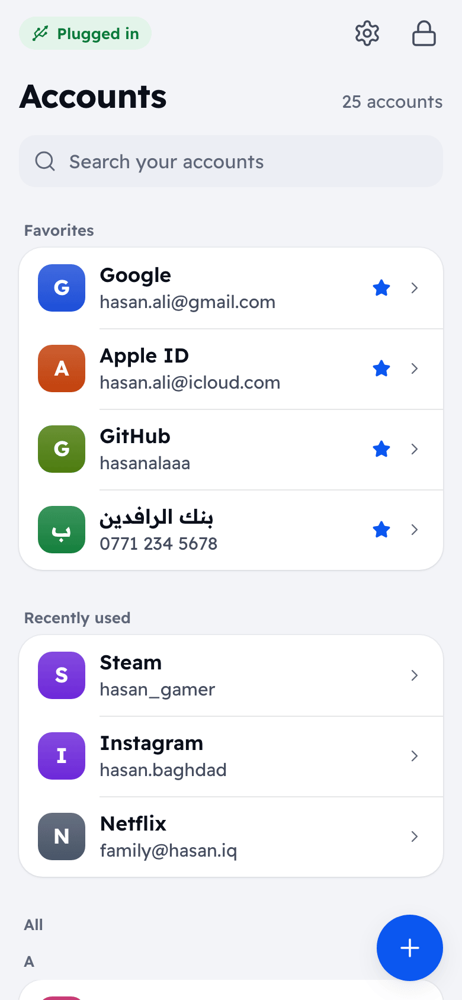
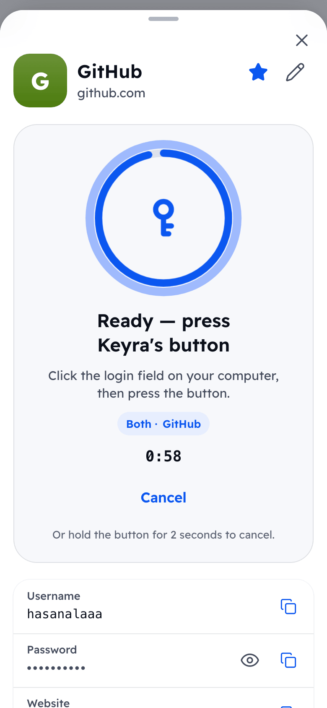
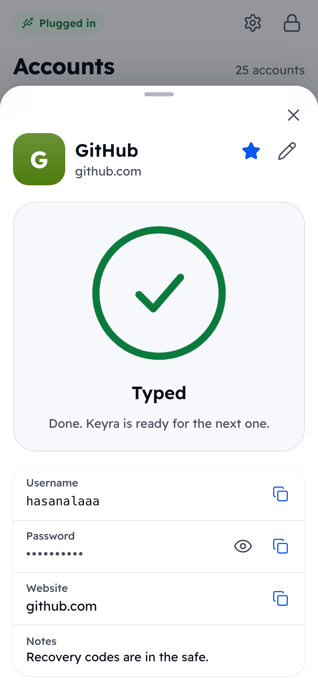
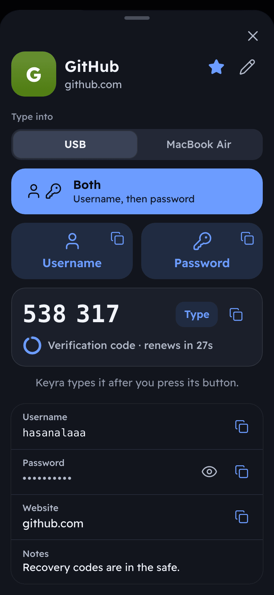

<div align="center">


# Keyra

**A pocket hardware password vault. Your passwords stay on the device, you manage them from your phone, and Keyra types them for you only when you press its button.**

[](https://github.com/hasanalaaa/keyra/actions/workflows/ci.yml)
[](LICENSE)
[](https://docs.espressif.com/projects/esp-idf/en/stable/esp32s3/)
[](docs/HARDWARE.md)

[How it works](#how-it-works) ·
[Quick start](#quick-start) ·
[Security](#security-model) ·
[Hardware](#hardware) ·
[FAQ](#faq) ·
[بالعربي](README.ar.md)

</div>

---

## بالعربي

**Keyra** خزنة كلمات مرور صغيرة بحجم الـ USB، مبنية على لوحة ESP32-S3. تبقى كلماتك مشفّرة داخل الجهاز، وتديرها من متصفح هاتفك عبر شبكة الجهاز نفسه (`http://keyra.local`)، وعند الحاجة **يكتب Keyra اسم المستخدم وكلمة المرور** في الكمبيوتر كأنه لوحة مفاتيح، **ولكن فقط بعد أن تضغط زر الجهاز بيدك**. لا حساب، لا سحابة، لا إنترنت.

اقرأ الشرح كاملاً بالعربية: **[README.ar.md](README.ar.md)**

---

## Why Keyra

Most password managers live in the same computer and browser that attackers target. Keyra moves the secret somewhere else.

- **Your vault never lives on the computer.** Nothing is stored or synced there: the computer only sees a keyboard typing the one credential you chose, at the moment you chose. No browser extension, no clipboard, no app to install.
- **Malware cannot make it type.** Every action needs a physical press of the button on the device. No press, no typing.
- **No cloud, no account, no subscription.** The vault is encrypted on the device and managed over the device's own Wi-Fi. Nothing leaves your desk.
- **Works on any computer.** If it accepts a USB keyboard (a work laptop, a locked-down kiosk, a TV, a console), Keyra works there. Phones, tablets and computers without a free port can pair with it over Bluetooth. Nothing to install.
- **Open and cheap.** MIT licensed firmware for a development board that costs a few dollars. Read it, build it, change it.
- **Easy enough to use daily.** A phone-first app in Arabic and English, built to feel as simple as the password manager on your phone.

Keyra is a convenience-and-isolation device, not a magic shield. Read the [security model](#security-model) for exactly what it does and does not protect.

## How it works

<div align="center">

</div>

1. **Plug in.** Connect Keyra's USB port to the computer. It shows up as a keyboard. (Or pair it once over Bluetooth: see below.)
2. **Join the Wi-Fi.** On your phone, join the network **Keyra-XXXX** and open **http://keyra.local**. (No sign-in sheet pops up; see the [FAQ](#faq).)
3. **Pick an account and what to type.** Unlock with your master passphrase, tap an account, and choose **Username**, **Password**, **Both** or **Code** (2FA).
4. **Press the button.** Click the login field on your computer, press Keyra's button, and it types. The LED flashes green and your phone says **Typed**.

A long press (1.5 seconds) cancels a pending action, or locks the vault if nothing is pending.

**Bluetooth.** In **Settings → Bluetooth**, tap **Pair a new device** and press Keyra's button. For the next 2 minutes Keyra shows up as a keyboard in your phone's, tablet's or computer's Bluetooth settings, and its light pulses cyan; pick it there. After that, **Type into: Auto** types over USB when Keyra is plugged in and otherwise into the Bluetooth device you used last (or pick one in the account sheet). Keyra connects to it only for the action, and the Ready screen tells you which device it is.

## Features

| | |
|---|---|
| **Types like a keyboard** | USB HID keyboard (US layout). Handles Caps Lock and always releases keys, even on errors. |
| **Bluetooth keyboard** | Bluetooth LE (HID over GATT) for phones, tablets and computers, with the same typing engine. Pairing only opens for 2 minutes after a button press; up to 4 devices; forget any of them from the app. |
| **Phone-first web app** | Installable to the home screen. Search, favorites, recents, password generator and strength meter. |
| **Arabic and English** | Full RTL support, auto-detected, switchable at any time. |
| **2FA codes** | Built-in TOTP (SHA-1/256/512, 6 or 8 digits, 30 or 60 seconds). Keyra can type the code too. Add the key by pasting a setup key or `otpauth://` link, or with **Scan QR from a photo**. |
| **Encrypted vault** | PBKDF2-HMAC-SHA256 (about 1.2 s on the device) and per-entry AES-256-GCM. |
| **Unlock rate limiting** | Failed attempts are counted before the key derivation runs; power-cycling does not reset the delay. |
| **Import** | Move from Apple Passwords, Chrome, Bitwarden or 1Password CSV exports, or move 2FA keys from a Google Authenticator export QR. |
| **Encrypted backup** | A passphrase-protected JSON file; restore by merging or replacing. |
| **Physical confirmation** | Typing, setup, Wi-Fi changes, Bluetooth pairing and factory reset all need a button press. |
| **Home Wi-Fi (optional)** | Keyra can join your home network so `keyra.local` opens from any device on it. Each new browser there is approved once with the button. |
| **Status LED** | Locked, ready, typing, success and error, readable at a glance. |
| **Auto-lock** | Locks after idle (1 to 120 minutes) and zeroizes keys in RAM. |
| **No lock-in** | Standard formats, open protocol ([docs/SPEC.md](docs/SPEC.md)), MIT license. |

## Screenshots

| Your vault | Ready — press the button | Typed ✓ | Account (dark) |
|:--:|:--:|:--:|:--:|
|  |  |  |  |

<p align="center"></p>

Arabic (right-to-left) and English, light and dark, phone and desktop — all generated from the real app by `npm --prefix web run e2e` (every screen is in [web/screenshots](web/screenshots)).

## Security model

The short version. The full threat model, cryptographic design and rate-limit schedule are in **[SECURITY.md](SECURITY.md)**.

**What Keyra does**

- Encrypts every entry with AES-256-GCM under a random data key, itself protected by a key derived from your passphrase (PBKDF2-HMAC-SHA256, calibrated to about 1.2 s).
- Rate-limits unlock attempts and counts them durably.
- Types only after a physical button press. The computer never gets a storage or network channel from Keyra.
- Lets a new Bluetooth device pair only during a 2-minute window opened by a button press; the rest of the time only already-paired devices can even connect.
- Keeps decrypted data in RAM only while unlocked, and zeroizes it on lock.

**What it does not do (honest limits)**

- **The phone link is plain HTTP over WPA2**, not TLS. Someone who knows your Keyra Wi-Fi password and is on the network can observe the traffic. Keep the Wi-Fi password private.
- **No secure element.** With physical access to the board, an attacker can dump the flash and guess your passphrase offline. Use a long passphrase.
- **Flash encryption and secure boot are optional** and off by default. They are irreversible eFuse steps ([docs/HARDWARE.md](docs/HARDWARE.md#optional-hardening-irreversible)).
- **Keyra has not been independently audited.**
- A keylogger on the computer can still see what Keyra types, as with any keyboard.
- **Bluetooth pairing is "Just Works"** (Keyra has no screen to show a code). Someone within radio range during the 2-minute pairing window could pair their own device, or try to sit in the middle of yours. Pair where you can see who is around, and check the device list afterwards. Details in [SECURITY.md](SECURITY.md#bluetooth).

If you need to report a vulnerability, please use a **private GitHub Security Advisory** as described in [SECURITY.md](SECURITY.md#reporting-a-vulnerability).

## Hardware

<div align="center">

<br><sub>Concept render of a future enclosure. Today Keyra runs on a bare ESP32-S3 dev board.</sub>
</div>

Keyra runs on a stock **ESP32-S3** dev board with at least **8 MB flash**. No soldering.

| | |
|---|---|
| **Reference board** | ESP32-S3-DevKitC-1 **N16R8** (PSRAM is optional) |
| **Button** | GPIO0 (the board's **BOOT** button) |
| **Status LED** | WS2812 on **GPIO38** (DevKitC-1 v1.1) or **GPIO48** (v1.0), set with `CONFIG_KEYRA_LED_GPIO` |
| **USB** | Plug the board's native **USB** port into the computer (not the UART port) |

Pin details, flashing options, enclosure ideas and the optional hardening steps: **[docs/HARDWARE.md](docs/HARDWARE.md)**.

## Quick start

### Option A: flash a prebuilt release

1. Download the release files from the [Releases page](https://github.com/hasanalaaa/keyra/releases).
2. Put the board in download mode (hold **BOOT**, plug in the **USB** port, release **BOOT**), or use the **UART** port, which needs no button.
3. Flash with [esptool](https://docs.espressif.com/projects/esptool/en/latest/) (offsets are from `flasher_args.json`):

```sh
esptool.py --chip esp32s3 -p <PORT> --before default-reset --after hard-reset \
  write_flash --flash-mode dio --flash-size 8MB --flash-freq 80m \
  0x0 bootloader.bin 0x8000 partition-table.bin 0xf000 ota_data_initial.bin 0x20000 keyra.bin
```

### Option B: build from source

You need [ESP-IDF 6.0.x](https://docs.espressif.com/projects/esp-idf/en/stable/esp32s3/get-started/) installed and exported in your shell (CI uses v6.0.2).

```sh
git clone https://github.com/hasanalaaa/keyra.git
cd keyra/firmware

# Release build: plain keyboard, logging off. Recommended for daily use.
idf.py -B build-release -D SDKCONFIG_DEFAULTS="sdkconfig.defaults;sdkconfig.release" build
idf.py -B build-release -p <PORT> flash

# Dev build: adds a USB serial log port and the 1200-baud reboot-to-ROM hook.
idf.py build
idf.py -p <PORT> flash monitor
```

The built web app is committed in `firmware/components/keyra_api/www/`, so you do **not** need Node.js to build the firmware. To rebuild the web app and refresh those files:

```sh
npm --prefix web ci && npm --prefix web run build
```

### First-time setup

1. Plug Keyra's **USB** port into a computer.
2. On your phone, join Wi-Fi **Keyra-XXXX** (the last four characters of the board's address). The factory password is **`keyra1234`**, and it is public. Setup makes you change it.
3. Open **http://keyra.local** (or `http://192.168.4.1`). Tap **Share, then Add to Home Screen** to make it one tap next time.
4. Follow the three steps: choose a **master passphrase** (10 characters or more; longer is better), choose a **new Wi-Fi password**, then **press the button on Keyra** to prove you are holding it.
5. Add accounts, or import a CSV from your current password manager (delete the CSV afterwards, it is unencrypted).

### Home Wi-Fi (optional)

Keyra can also join your home network, so you can open it from any phone or laptop at home without switching Wi-Fi.

1. In **Settings → Home Wi-Fi**, turn on **Use home Wi-Fi** and pick your network. Keyra only joins password-protected (WPA2/WPA3) networks.
2. Enter the network's password, tap **Join**, then **press Keyra's button**. The sheet shows **Connected**, Keyra's address on your network and the signal strength.
3. From any device on that network, open **http://keyra.local**. If a device cannot resolve `.local` names, use the address shown in the sheet.
4. The first time each browser unlocks Keyra through the home network, Keyra asks you to **press its button to trust that browser**. Trusted browsers (up to 8) are listed in **Settings → Trusted browsers**, where you can remove them. Removing one signs it out.

**Keep Keyra's own Wi-Fi on** is on by default. Turn it off and Keyra's own Wi-Fi switches off about 15 seconds after Keyra joins your home network; it comes back if the home network has been unavailable for 60 seconds, or 30 seconds after power-up if Keyra has not joined by then, so Keyra stays reachable. Keyra has one radio: its own Wi-Fi moves to your home network's channel, and phones joined to it may reconnect once. While home Wi-Fi is connected, Keyra sets its clock from the internet (NTP), so 2FA codes work without a phone having set the time.

## Project layout

```
keyra/
├── firmware/                  ESP-IDF 6.0 project (C++17)
│   ├── main/                  app_main: wiring only
│   ├── components/
│   │   ├── keyra_vault/       crypto, encrypted storage, TOTP, backup (host-tested)
│   │   ├── keyra_hid/         typing engine over USB (TinyUSB) or Bluetooth, dev CDC port
│   │   ├── keyra_ble/         Bluetooth LE keyboard (NimBLE, HID over GATT), pairing and bonds
│   │   ├── keyra_io/          button (GPIO0) and RGB status LED
│   │   ├── keyra_net/         Wi-Fi access point, DNS, mDNS (keyra.local)
│   │   └── keyra_api/         HTTP server, REST API, sessions, pending-action state machine
│   ├── test/host/             host test runner (CMake + ctest, no board needed)
│   ├── partitions.csv         8 MB layout: 2 app slots + LittleFS vault
│   └── sdkconfig.defaults / sdkconfig.release   dev and release profiles
├── web/                       Preact + TypeScript app, built into one gzipped file
├── tools/                     devctl.py: flash, reset and log over native USB
├── docs/                      SPEC.md, DESIGN.md, HARDWARE.md, IMAGE_PROMPTS.md, images/
└── .github/                   CI, issue and PR templates
```

[docs/SPEC.md](docs/SPEC.md) is the contract between firmware and web app (REST API, behavior, security model). [docs/DESIGN.md](docs/DESIGN.md) is the design system.

## Development

```sh
# Host tests: vault, TOTP, key map, action state machine. No board needed.
# Requires CMake, a C++17 compiler and OpenSSL 3 headers (libssl-dev, or openssl@3 on Homebrew).
cmake -S firmware/test/host -B build/host && cmake --build build/host && ctest --test-dir build/host

# Web: typecheck and unit tests
npm --prefix web ci
npm --prefix web run typecheck
npm --prefix web test

# Web UI without a board: a mock of the device API (demo passphrase: keyra demo vault)
npm --prefix web run mock

# End-to-end run in a headless browser (Playwright); regenerates the screenshots
npm --prefix web run e2e
```

CI runs the host tests, the web checks and both firmware profiles on every push and pull request; `tools/ci_local.sh` runs the same jobs locally. See [CONTRIBUTING.md](CONTRIBUTING.md).

## Roadmap

Ideas, not promises. Priorities follow what real users on real boards report.

- [x] 0.1: encrypted vault, USB typing, phone app (EN/AR), TOTP, import, backup, CI
- [x] Bluetooth LE keyboard (unreleased; on the main branch)
- [ ] Tested board matrix and a prebuilt release for each
- [ ] Browser-based flashing from the release page
- [ ] More keyboard layouts (the key map is US-only today)
- [ ] Printable enclosure and a purpose-built PCB
- [ ] Over-the-air firmware updates (the partition table already has two app slots)
- [ ] Independent security review

## FAQ

**Why doesn't my phone show a "sign in to Wi-Fi" popup?**
On purpose. Keyra answers your phone's connectivity checks as "online" so the phone joins like any normal network and does not open a cramped captive-portal sheet (which often cannot run the app properly or keep cookies). Just open **http://keyra.local** in your regular browser. If that name does not resolve, use `http://192.168.4.1`.

**Does it work with keyboard layouts other than US?**
Today, Keyra types as a **US-layout** keyboard. If your computer is set to another layout, characters will come out differently. Switch the computer to US for the login field, or keep to characters that are the same on both layouts. Characters outside printable ASCII are refused with a clear message instead of typing the wrong thing. More layouts are on the roadmap.

**Can Keyra type into my phone or tablet?**
Yes, over Bluetooth. Pair it once from **Settings → Bluetooth** (see [How it works](#how-it-works)). iPhone and iPad hide their on-screen keyboard while any Bluetooth keyboard is connected, so by default (**Connect: When typing**, recommended) Keyra connects only for each action: it shows "Connecting to your device…" for a moment, types after your press, and lets go about 20 seconds later. Choose **Always** if you prefer instant typing and do not mind the hidden on-screen keyboard. The account sheet's **Type into** picker chooses USB or a paired device; this browser remembers the choice.

**I forgot my master passphrase. Can I recover my passwords?**
No. That is the point of encryption, and there is no backdoor. You can **erase the device and start over**: on the unlock screen choose **Forgot passphrase?**, then press Keyra's button to confirm. All accounts are deleted. Restore from a backup if you have one.

**Is it safe to type a password with a button press? What if the wrong window is focused?**
The action is armed for 60 seconds and runs once on the press. Click the right field first. A long press cancels.

**Why HTTP and not HTTPS?**
A device on its own network cannot get a certificate that browsers trust without installing something on each phone, and a browser warning teaches people to ignore warnings. The link is protected by WPA2 and a private Wi-Fi password instead. This is a real limit: see [SECURITY.md](SECURITY.md).

**Can I add a 2FA key from a QR code?**
Yes. In the account form, tap **Scan QR from a photo**, then take a photo of the QR or choose a saved picture. The picture is decoded inside your phone's browser; it is never sent to Keyra or anywhere else. Keyra's page is plain HTTP, so browsers do not allow a live camera view there, hence the photo. Plain `otpauth://totp/…` QR codes fill the 2FA field (and the name and user name if they are empty). For Google Authenticator, use **Import**, then **Google Authenticator export**: it lists the accounts in the export QR (several QR codes for big exports, one scan each) and either adds them as new accounts or adds the key to existing accounts that match by name and user name. Keyra only makes time-based codes, so counter-based (HOTP) entries, MD5 and unusual digit counts or periods are rejected or skipped with a message. Delete any photo or screenshot of the QR afterwards: it holds your keys unencrypted.

**Do I need an internet connection?**
No. Keyra creates its own Wi-Fi network, and your phone does not need internet while connected to it (it may keep using mobile data for other apps). If you turn on home Wi-Fi, Keyra uses the internet only to set its clock (NTP); your vault never leaves the device.

**Do I still need Keyra's own Wi-Fi once home Wi-Fi works?**
Not for everyday use at home: open http://keyra.local on your home network instead. Keyra's own Wi-Fi is still useful. It is how you set Keyra up and how you reach it when the home network is down (with **Keep Keyra's own Wi-Fi on** turned off, it comes back after a minute without the home network). It is also the safer way to unlock on a network you do not fully trust, because traffic on it is visible only to devices that know Keyra's Wi-Fi password (see [SECURITY.md](SECURITY.md#home-wi-fi-optional)). If you never want it while at home, turn **Keep Keyra's own Wi-Fi on** off.

**Can the computer read my vault?**
Keyra presents only a keyboard to the computer. It has no storage interface and no network path to it. The computer sees what gets typed, and nothing else. Over Bluetooth it is the same: a paired device sees a keyboard, Keyra's name and maker, and a battery level, nothing more.

**What does it cost?**
A compatible ESP32-S3 board is usually a few dollars to about ten.

## Contributing

Bug reports, hardware test reports, translations and pull requests are welcome. Start with [CONTRIBUTING.md](CONTRIBUTING.md) and the [Code of Conduct](CODE_OF_CONDUCT.md). For security issues, use a private advisory ([SECURITY.md](SECURITY.md)).

## License

[MIT](LICENSE) © 2026 hasanalaaa. Third-party components keep their own licenses (ESP-IDF, TinyUSB, LittleFS, cJSON, Preact).
