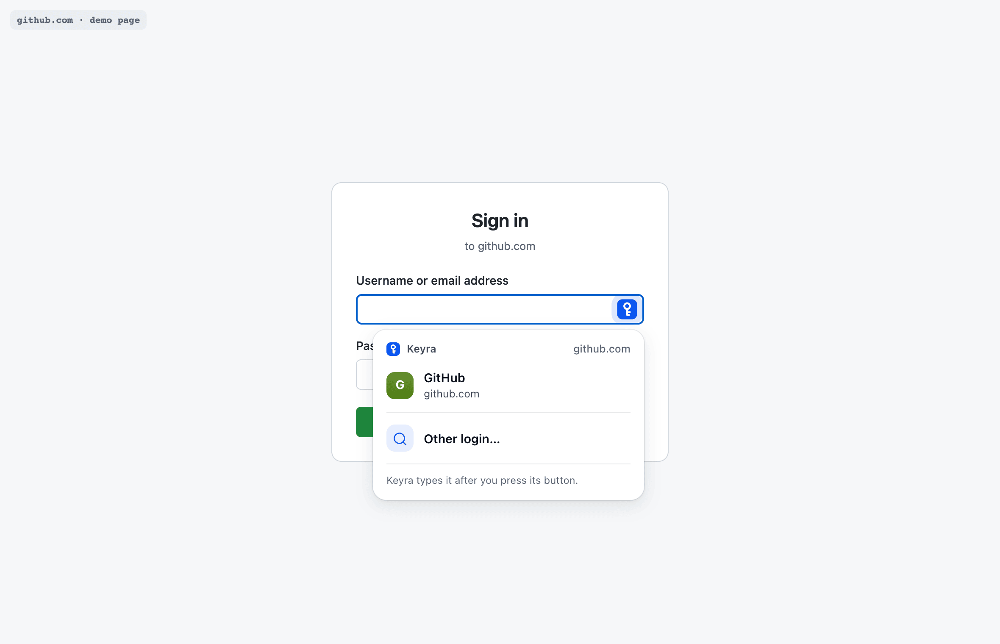
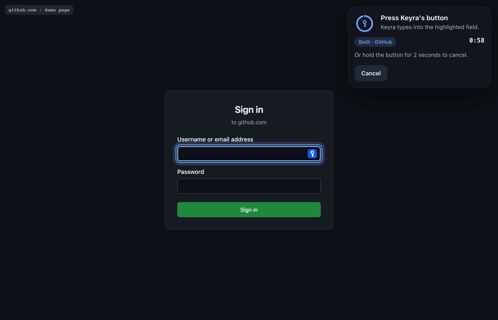
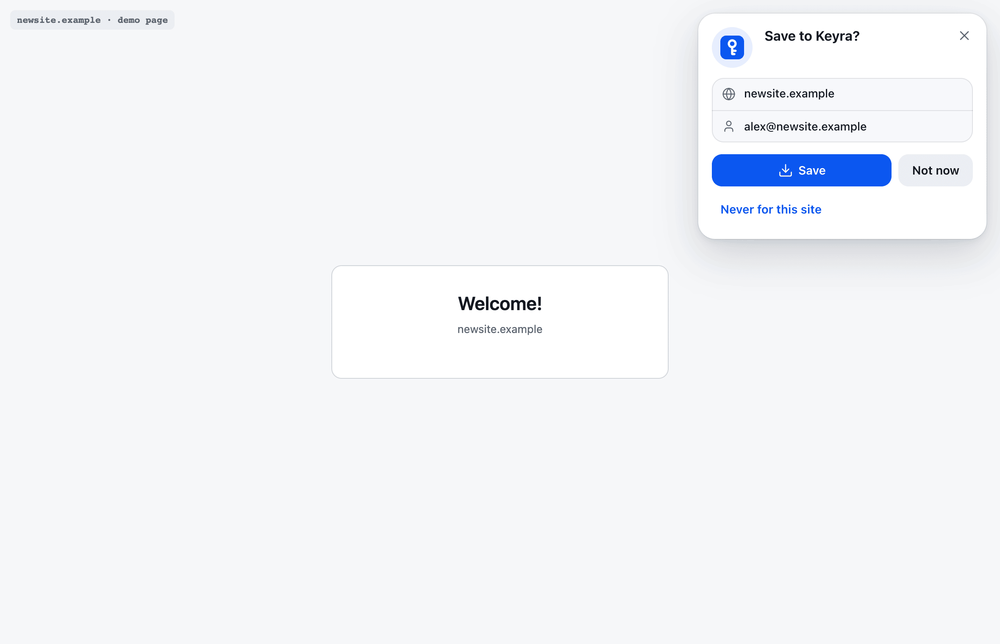
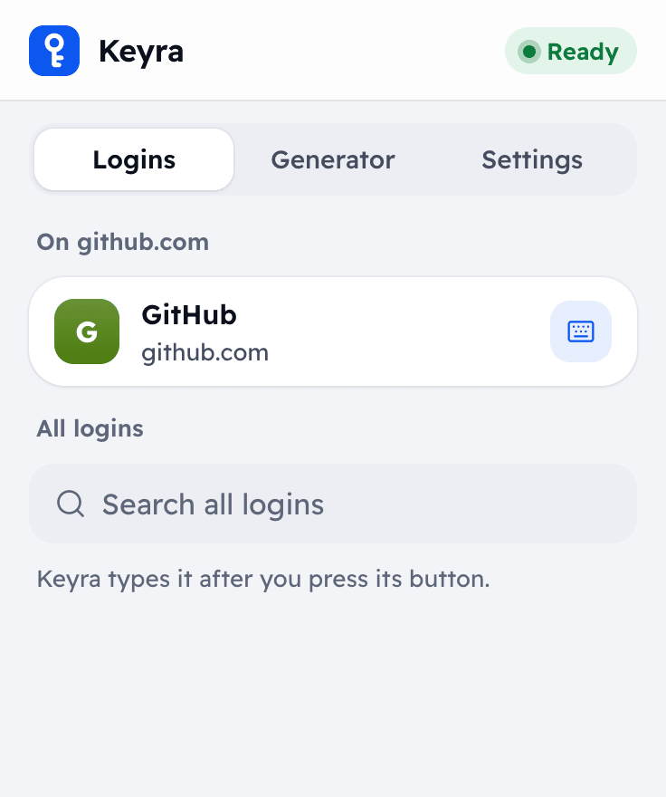
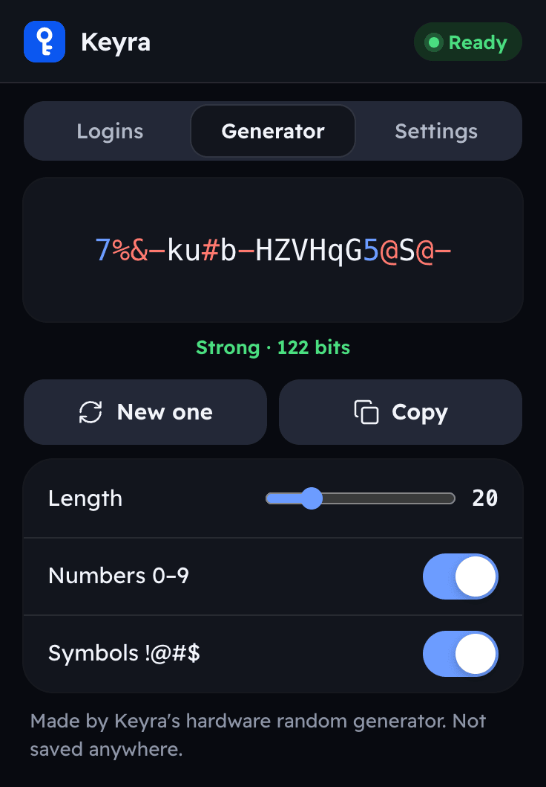
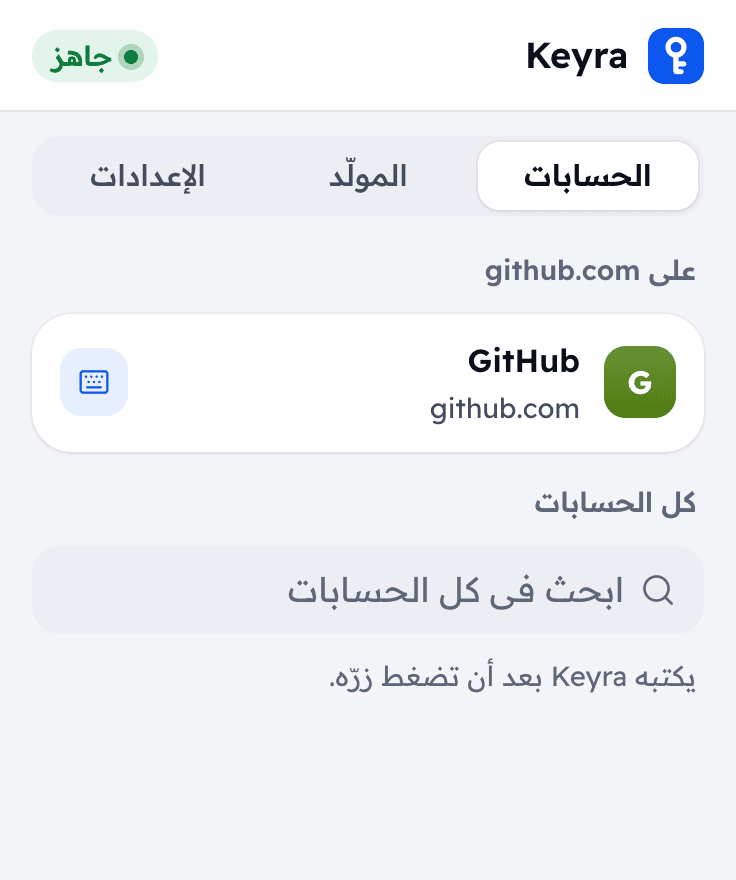

# Keyra Companion (browser extension)

Pick a login on a website and Keyra types it after you press its button. The
extension only ever *asks*: it never receives a stored password, username or
2FA code, and every typing and every save still waits for a press of the
button on Keyra. Contract: [SPEC §9.4](../docs/SPEC.md) on top of access
tokens (§17); host matching: [HOST-MATCH.md](../docs/research/HOST-MATCH.md).

| Logins for this site | Press Keyra's button | Save to Keyra? |
|:--:|:--:|:--:|
|  |  |  |

| Toolbar popup | Generator | العربية |
|:--:|:--:|:--:|
|  |  |  |

Every screen, in Arabic and English, light and dark, is in [screenshots/](screenshots)
(regenerated by `npm run e2e`).

## What it does

- **Fill by typing.** A small Keyra key appears at the end of a focused login
  field (never over the site's own icons). It lists the logins saved for this
  site; pick one and Keyra gets it ready: the extension focuses the right field,
  outlines it, and shows **Press Keyra's button** with the 60-second countdown,
  then **Typed**, **Cancelled** or what went wrong and how to fix it.
- **Phishing guard.** Only logins whose host matches the page are offered.
  **Other login…** can pick any login, but on another site it first shows a
  warning naming both hosts; Keyra's phone screen then shows the page host too.
- **New passwords.** In sign-up and change-password forms the key also offers
  **Strong password from Keyra** (Keyra's hardware random generator): it fills
  the new password and its confirmation.
- **Save or update.** After a form with a password is sent, a card asks
  **Save to Keyra?** (Save / Not now / Never for this site), or **Update the
  password for …?** when Keyra already has that username for the site. A plain
  sign-in with a login Keyra already has asks nothing. The card survives one
  page change and is dropped after two minutes. Saving needs a press.
- **Toolbar popup.** Connection state (offline / locked → **Open Keyra** /
  ready), the logins for the current site, a search over every login with
  **Type into this page**, the generator, and settings (show the key in fields,
  offer to save, the never-save list, disconnect).
- Arabic and English (from the browser's language), right-to-left, light and
  dark, in Keyra's design (Quiet Glass, Readex Pro in the popup).

## Install

Build it first (Node 22 or newer):

```sh
npm --prefix extension ci
npm --prefix extension run build   # → extension/dist/chrome and extension/dist/firefox
```

**Chrome, Edge, Brave, Opera, Vivaldi.** Open `chrome://extensions` (Edge:
`edge://extensions`), turn on **Developer mode**, click **Load unpacked** and
choose `extension/dist/chrome`. Pin the Keyra button to the toolbar.

**Firefox (128 or newer).** Open `about:debugging#/runtime/this-firefox`, click
**Load Temporary Add-on…** and choose `extension/dist/firefox/manifest.json`.
A temporary add-on is removed when Firefox quits. To keep it, sign it for free
as an unlisted add-on on [addons.mozilla.org](https://addons.mozilla.org/developers/)
(zip the *contents* of `dist/firefox`, or use `web-ext sign`) and install the
signed `.xpi`. If Firefox lists the extension as needing permission on
websites (Add-ons → Keyra Companion → Permissions), allow it, or the Keyra key
cannot appear in login fields.

**Safari.** Not shipped. Apple's converter can wrap the Chrome build into an
Xcode project (`xcrun safari-web-extension-converter extension/dist/chrome`);
it needs a Mac, Xcode and signing, and has not been tested.

## Connect (one press)

1. Click the Keyra button in the toolbar. Enter Keyra's address
   (`http://keyra.local` on your home Wi‑Fi, `http://192.168.4.1` on Keyra's
   own Wi‑Fi) and click **Connect**. The browser asks to let the extension
   reach that address — only that one.
2. A Keyra tab opens. Unlock Keyra if asked, check the name (for example
   "Chrome on Mac") and which logins it may use, tap **Create token** and press
   Keyra's button.
3. The tab hands the new access token to the extension and closes by itself.
   The web app does not keep it.

Instead of step 2–3 you can create a token yourself in **Settings → Apps and
agents** (used by **Browser**) and paste it under **Paste a token instead**.
To disconnect, use **Settings → Disconnect this browser** in the popup, and
revoke the token in Keyra's **Settings → Apps and agents** (that stops it at
once, everywhere).

The computer must reach Keyra: Keyra on your home Wi‑Fi (SPEC §8.2), or the
computer on Keyra's own Wi‑Fi.

## Privacy

- Stored by the extension (`storage.local`): Keyra's address, the access token
  and its own settings (show the key, offer to save, the never-save list,
  generator length and character sets). Nothing is synced.
- A password you type into a website's form is held only in the service
  worker's memory between sending the form and your answer to the save card (at
  most two minutes), and sent once to Keyra when you choose **Save**. The card
  itself (site, title, username, no password) waits in `storage.session` for that
  tab, which the browser clears when it closes.
- Matching sends Keyra only the page's host name (`github.com`), never the path
  or query. Saving sends the page's origin (`https://github.com`).
- No analytics, no remote code, no other servers: the extension talks only to
  the Keyra address you entered.
- The extension stays out of Keyra's own web app.

## Permissions, and why

| Permission | Why |
|---|---|
| `storage` | Keyra's address, the token and the settings; the pending save card per tab. |
| `scripting` | Injecting the pairing listener into the one Keyra tab the extension opens to connect (SPEC §9.4 step 2). |
| Optional host permission for Keyra's address only | Asked at **Connect** for the address you typed. Requests to Keyra go from the extension's service worker with this permission; Keyra adds no CORS headers. |
| Content script on `http://*/*` and `https://*/*` | Finding login fields and showing the key and the cards on websites. This is why the browser says the extension can "read and change data on websites". It reads form fields only to find login forms and, after you send one, to offer saving it. |

## Security notes

- The token can list login *titles and hosts* in its scope and ask Keyra to
  type or save; it cannot read anything secret. Every request waits for the
  physical press, and Keyra's phone screen names the login and who asked.
- Keyra allows 10 requests per 10 seconds per token; the extension caches the
  list for 15 seconds and waits out the limit once before showing "Too many
  requests".
- Keyra speaks plain HTTP on your network (SPEC §6): someone who can watch that
  traffic could copy the token and ask Keyra to type, but never read a password,
  and still not without your press. Scope the token to the logins it needs and
  revoke it if in doubt.
- The in-page UI lives in a closed shadow root, so pages cannot read or click
  it. Only the e2e build opens it for the test runner.

## Development

```sh
npm --prefix extension run typecheck
npm --prefix extension test          # host rule (HOST-MATCH.md table), form detection, API client vs. the mock
npm --prefix web run build           # the mock serves the web app (pairing screen)
npm --prefix extension run e2e       # Chromium + extension + web/mock/server.mjs + local demo sites
```

`e2e` builds `dist/chrome-e2e` (and `-ar`): the test address already granted,
the shadow root open, the UI language pinned. It maps `keyra.test`,
`github.com`, `evil.example` and `newsite.example` to local servers, pairs with
one press, types, generates, saves, updates, checks the anyHost guard, and
writes the screenshots. `HEADED=1` shows the browser; `SHOTS=0` skips the
screenshots.

Layout: `src/background.ts` (service worker: API client, token, pairing,
pending saves), `src/content/` (in-page UI), `src/popup/`, `src/forms.ts` (form
detection), `src/host.ts` (host rule), `src/api.ts`, `src/strings.ts` (English
and Arabic; `build.mjs` writes `_locales`). Icons come from
`docs/images/icon.png` (`npm run icons`).
